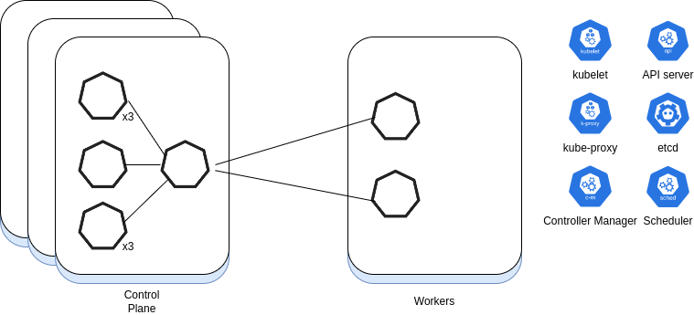
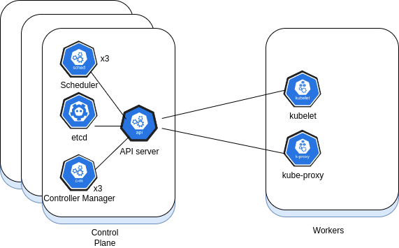
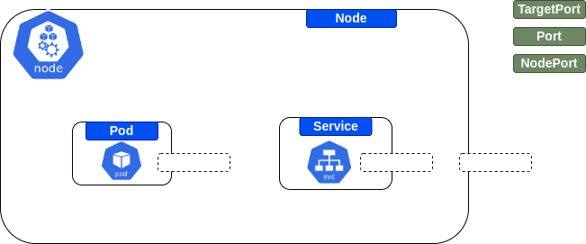
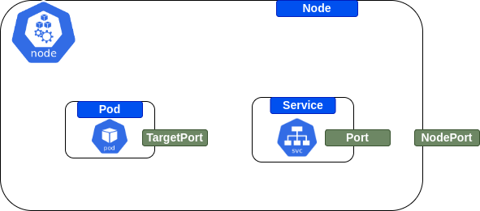

# Kubernetes

<!--  -->

What's your goal?

* I would like to prepare for CKA certification
  * See [CKA](CKA.md) page
* I would like to learn Kubernetes by practicing both theoritcal and practical material
  * Solve [exercises](#kubernetes-exercises)
  * Solve [questions](#kubernetes-questions)
* I would like to learn parctical Kubernetes
  * Solve [exercises](#kubernetes-exercises)

- [Kubernetes](#kubernetes)
  - [Kubernetes Exercises](#kubernetes-exercises)
    - [Pods](#pods)
    - [Service](#service)
    - [ReplicaSet](#replicaset)
    - [Labels and Selectors](#labels-and-selectors)
    - [Scheduler](#scheduler)
    - [Kustomize](#kustomize)
  - [Kubernetes Questions](#kubernetes-questions)
    - [Kubernetes 101](#kubernetes-101)
    - [Cluster and Architecture](#cluster-and-architecture)
      - [Kubelet](#kubelet)
      - [Nodes Commands](#nodes-commands)
    - [Pods](#pods-1)
      - [Static Pods](#static-pods)
      - [Pods Commands](#pods-commands)
      - [Pods Troubleshooting and Debugging](#pods-troubleshooting-and-debugging)
    - [Labels and Selectors](#labels-and-selectors-1)
    - [Deployments](#deployments)
      - [Deployments Commands](#deployments-commands)
    - [Services](#services)
    - [Ingress](#ingress)
    - [ReplicaSets](#replicasets)
    - [DaemonSet](#daemonset)
      - [DaemonSet - Commands](#daemonset---commands)
    - [StatefulSet](#statefulset)
    - [Storage](#storage)
      - [Volumes](#volumes)
    - [Networking](#networking)
    - [Network Policies](#network-policies)
    - [etcd](#etcd)
    - [Namespaces](#namespaces)
      - [Namespaces - commands](#namespaces---commands)
      - [Resources Quota](#resources-quota)
    - [Operators](#operators)
    - [Secrets](#secrets)
    - [Volumes](#volumes-1)
    - [Access Control](#access-control)
    - [Patterns](#patterns)
    - [CronJob](#cronjob)
    - [Misc](#misc)
    - [Gatekeeper](#gatekeeper)
    - [Policy Testing](#policy-testing)
    - [Helm](#helm)
      - [Commands](#commands)
    - [Security](#security)
    - [Troubleshooting Scenarios](#troubleshooting-scenarios)
    - [Istio](#istio)
    - [Controllers](#controllers)
    - [Scheduler](#scheduler-1)
      - [Node Affinity](#node-affinity)
    - [Taints](#taints)
    - [Resource Limits](#resource-limits)
      - [Resources Limits - Commands](#resources-limits---commands)
    - [Monitoring](#monitoring)
    - [Kustomize](#kustomize-1)
    - [Deployment Strategies](#deployment-strategies)
    - [Scenarios](#scenarios)

## Kubernetes Exercises

### Pods

|Name|Topic|Objective & Instructions|Solution|Comments|
|--------|--------|------|----|----|
| My First Pod | Pods | [Exercise](pods_01.md) | [Solution](solutions/pods_01_solution.md)
| "Killing" Containers | Pods | [Exercise](killing_containers.md) | [Solution](solutions/killing_containers.md)

### Service

|Name|Topic|Objective & Instructions|Solution|Comments|
|--------|--------|------|----|----|
| Creating a Service | Service | [Exercise](services_01.md) | [Solution](solutions/services_01_solution.md)

### ReplicaSet

|Name|Topic|Objective & Instructions|Solution|Comments|
|--------|--------|------|----|----|
| Creating a ReplicaSet | ReplicaSet | [Exercise](replicaset_01.md) | [Solution](solutions/replicaset_01_solution.md)
| Operating ReplicaSets | ReplicaSet | [Exercise](replicaset_02.md) | [Solution](solutions/replicaset_02_solution.md)
| ReplicaSets Selectors | ReplicaSet | [Exercise](replicaset_03.md) | [Solution](solutions/replicaset_03_solution.md)

### Labels and Selectors

|Name|Topic|Objective & Instructions|Solution|Comments|
|--------|--------|------|----|----|
| Labels and Selectors 101 | Labels, Selectors | [Exercise](exercises/labels_and_selectors/exercise.md) | [Solution](exercises/labels_and_selectors/solution.md)
| Node Selectors | Labels, Selectors | [Exercise](exercises/node_selectors/exercise.md) | [Solution](exercises/node_selectors/solution.md)


### Scheduler

|Name|Topic|Objective & Instructions|Solution|Comments|
|--------|--------|------|----|----|
| Taints 101 | Taints | [Exercise](exercises/taints_101/exercise.md) | [Solution](exercises/taints_101/solution.md)

### Kustomize

|Name|Topic|Objective & Instructions|Solution|Comments|
|--------|--------|------|----|----|
| common labels | Kustomize | [Exercise](exercises/kustomize_common_labels/exercise.md) | [Solution](exercises/kustomize_common_labels/solution.md)

## Kubernetes Questions

### Kubernetes 101

<details>
<summary>What is Kubernetes? </summary><br>
Kubernetes is an open-source system for automating deployment, scaling, and management of containerized applications. It was originally developed by Google and is now maintained by the Cloud Native Computing Foundation.

Kubernetes is used by organizations of all sizes to manage their containerized applications. Some of the benefits of using Kubernetes include:

* **Scalability:** Kubernetes can be used to scale applications up or down based on demand. This can help organizations save money on resources and improve the performance of their applications.
* **Reliability:** Kubernetes can be used to ensure that applications are always available to users. This is done by using a variety of techniques, such as replication and load balancing.
* **Security:** Kubernetes can be used to secure applications by isolating them from each other and from the underlying infrastructure.

></details>

<details> 
<summary>why organizations are adopting Kubernetes?</summary>


Kubernetes is a complex system, but it can be a valuable tool for organizations that want to manage their containerized applications.

Here are some of the reasons why organizations are using Kubernetes:

* **To improve scalability:** Kubernetes can be used to scale applications up or down based on demand. This can help organizations save money on resources and improve the performance of their applications.
* **To improve reliability:** Kubernetes can be used to ensure that applications are always available to users. This is done by using a variety of techniques, such as replication and load balancing.
* **To improve security:** Kubernetes can be used to secure applications by isolating them from each other and from the underlying infrastructure.
* **To reduce operational overhead:** Kubernetes can automate many of the tasks involved in managing containerized applications, such as deployment, scaling, and maintenance. This can free up IT staff to focus on other tasks.
* **To improve developer productivity:** Kubernetes can make it easier for developers to build, deploy, and manage containerized applications. This is because Kubernetes provides a consistent environment for running applications, regardless of the underlying infrastructure.

Overall, Kubernetes is a powerful tool that can help organizations improve the scalability, reliability, security, and operational efficiency of their containerized applications.
</details>


<details>
<summary>why you might not want to use Kubernetes?</summary><br>

Kubernetes is a powerful tool for managing containerized applications, but it's not always the right choice. Here are a few reasons why you might not want to use Kubernetes:

- Your application is not containerized. Kubernetes is designed to manage containerized applications. If your application is not containerized, you'll need to containerize it before you can use Kubernetes.
- Your application is not complex enough. Kubernetes is a complex tool, and it can be overkill for simple applications. If your application is simple, you may be able to get away with using a simpler orchestration tool, such as Docker Swarm.
- You don't have the resources to manage Kubernetes. Kubernetes can be a lot of work to manage. If you don't have the resources to dedicate to managing Kubernetes, you may want to consider using a managed Kubernetes service.

</details>

<details>
<summary>Why you might want to use Kubernetes?</summary><br>

Kubernetes is a powerful tool for managing containerized applications, but it's not always the right choice. Here are a few reasons why you might not want to use Kubernetes:

- Your application is not containerized. Kubernetes is designed to manage containerized applications. If your application is not containerized, you'll need to containerize it before you can use Kubernetes.
- Your application is not complex enough. Kubernetes is a complex tool, and it can be overkill for simple applications. If your application is simple, you may be able to get away with using a simpler orchestration tool, such as Docker Swarm.
- You don't have the resources to manage Kubernetes. Kubernetes can be a lot of work to manage. If you don't have the resources to dedicate to managing Kubernetes, you may want to consider using a managed Kubernetes service.

</details>

<details>
<summary>What are some of Kubernetes features?</summary><br>

- auto-scaling: Kubernetes can automatically scale containerized applications and their resources up or down based on usage.
- Lifecycle management: Kubernetes can automate deployments and updates with the ability to roll out changes to your application or its configuration in a progressive manner, while monitoring application health to ensure it doesn't kill all your instances at the same time. It can also rollback the change if something goes wrong.
- Declarative model: Kubernetes uses a declarative model for describing the desired state of your application. This makes it easy to specify how you want your application to be deployed and managed.
- Resilience and self-healing: Kubernetes is designed to be resilient to failures. If a container fails, Kubernetes will automatically restart it. Kubernetes can also detect and automatically recover from other types of failures, such as network outages or node failures.
- Persistent storage: Kubernetes can manage persistent storage for your applications. This means that your applications can store data in a durable way, even if the containers that are running them fail.
- Service discovery: Kubernetes provides a way for containerized applications to find each other. This is done by using a service registry, which is a central repository of information about services.
- Load balancing: Kubernetes can automatically distribute traffic across multiple instances of your application. This helps to ensure that your application is always available to users.
- etwork policies: Kubernetes can be used to control network traffic between containers. This can be used to improve security and performance.
- Security: Kubernetes provides a number of features that can be used to improve the security of your containerized applications. These features include role-based access control (RBAC), network policies, and secrets management.


</details>

<details>
<summary>What Kubernetes objects are there?</summary><br>

Kubernetes objects are the basic building blocks of a Kubernetes cluster. They are used to represent the state of your cluster and to define the desired state of your applications.

There are many different types of Kubernetes objects, but some of the most common ones include:

- Pods: Pods are the smallest unit of deployment in Kubernetes. A pod is a group of one or more containers that are scheduled on the same node.
- Services: Services provide a way to expose applications running in pods to the outside world.
- Volumes: Volumes are used to store data that is persistent across pod restarts.
- Namespaces: Namespaces are used to isolate resources from each other.
- Deployments: Deployments are used to manage the deployment and scaling of pods.
- ReplicationControllers: ReplicationControllers are used to ensure that a specified number of pods are running at all times.
- DaemonSets: DaemonSets are used to ensure that a pod is running on every node in the cluster.
- StatefulSets: StatefulSets are used to manage stateful applications.
- ConfigMaps: ConfigMaps are used to store configuration data that can be shared between pods.
- Secrets: Secrets are used to store sensitive data, such as passwords and keys.
  ...
</details>

<details>
<summary>What fields are mandatory with any Kubernetes object?</summary><br>

In Kubernetes, the fields that are mandatory for any object can vary depending on the specific object type. However, there are some common fields that are typically required for most Kubernetes objects. Here are a few essential fields that are commonly mandatory:

- apiVersion: Specifies the Kubernetes API version used to interpret the object configuration. For example, "v1" is the API version for most core objects.

- kind: Specifies the kind of the object, which represents the type of resource being defined. Examples include "Pod," "Deployment," "Service," etc.

- metadata: Contains metadata about the object, such as the name, labels, and annotations. The name field is typically mandatory and provides a unique identifier for the object.

- spec: Defines the desired state of the object. The fields within the spec can vary based on the object type. For example, a Pod's spec includes the containers and volumes, while a Deployment's spec includes replicas and template specifications.

- status: Represents the current observed state of the object. The status field is typically not specified by the user but is automatically updated by the Kubernetes system.
 </details>

<details>
<summary>What is kubectl?</summary><br>

Kubectl is a command-line tool that allows you to interact with a Kubernetes cluster. It can be used to deploy applications, manage resources, and view logs. Kubectl is available for a variety of operating systems, including Linux, macOS, and Windows.

To use kubectl, you need to first install it. The installation process varies depending on your operating system. Once kubectl is installed, you can use it to interact with your Kubernetes cluster.

To get started, you can use the following command to list all of the resources in your cluster:

```
kubectl get all
```

This command will list all of the pods, services, deployments, and other resources in your cluster.

You can also use kubectl to create, update, and delete resources. For example, to create a new pod, you would use the following command:

```
kubectl create -f pod.yaml
```

Where pod.yaml is a file that contains the definition of the pod you want to create.

For more information on how to use kubectl, you can refer to the kubectl documentation.

Here are some of the most common kubectl commands:

* `kubectl get`: Get information about resources.
* `kubectl create`: Create a new resource.
* `kubectl update`: Update an existing resource.
* `kubectl delete`: Delete a resource.
* `kubectl describe`: Get detailed information about a resource.
* `kubectl logs`: View the logs for a pod.
* `kubectl exec`: Execute a command in a pod.
* `kubectl port-forward`: Forward a port from your local machine to a pod.

Kubectl is a powerful tool that can be used to manage Kubernetes clusters. With kubectl, you can easily deploy applications, manage resources, and view logs.

</details>

<details>
<summary>What Kubernetes objects do you usually use when deploying applications in Kubernetes?</summary><br>

The Kubernetes objects I usually use when deploying applications in Kubernetes are:

* **Pods** are the smallest units of deployment in Kubernetes. A pod is a group of one or more containers that are scheduled together on the same node. Pods share resources such as network interfaces and volumes.
* **Services** provide a way to expose applications running in pods. A service is an abstraction that defines a set of pods and a single IP address and port that can be used to access those pods.
* **Volumes** are objects whose purpose is to provide storage to pods. Volumes can be mounted into pods and used to store data.
* **ConfigMaps** are objects that can be used to store configuration data for pods. ConfigMaps are typically used to store things like environment variables or application configuration files.
* **Secrets** are objects that can be used to store sensitive data such as passwords or API keys. Secrets are typically used to store data that should not be exposed to the public.
* **Deployments** are controller objects that provide instructions on how Kubernetes should manage the pods hosting a containerized application. Deployments can be used to create, update, and delete pods in a controlled manner.
* **DaemonSets** are controller objects that ensure that a copy of a pod is running on every node in the cluster. DaemonSets are typically used to run services that need to be available on every node, such as logging or monitoring agents.
* **StatefulSets** are controller objects that are designed to manage stateful applications. StatefulSets ensure that pods are created and deleted in a consistent manner, and that they are assigned the same storage volume.
* **Jobs** are controller objects that are used to run a one-off task. Jobs can be used to run things like batch jobs or to perform maintenance tasks.

These are just a few of the many Kubernetes objects that can be used to deploy applications in Kubernetes. The specific objects that you use will depend on the specific needs of your application.

</details>

<details>
<summary>Why there is no such command in Kubernetes? <code>kubectl get containers</code></summary><br>

There is no such command as `kubectl get containers` because containers are not first-class objects in Kubernetes. Containers are always contained within pods, and so the command to list containers is `kubectl get pods`. This command will list all pods in the cluster, along with the containers that are running in each pod.


</details>

<details>
<summary>What actions or operations you consider as best practices when it comes to Kubernetes?</summary><br>

Here are some of the best practices I consider when it comes to Kubernetes:

* **Use the latest version of Kubernetes.** Kubernetes is constantly being updated, and new features and bug fixes are released on a regular basis. By using the latest version of Kubernetes, you can ensure that you are getting the most out of the platform.
* **Use a version control system to manage your Kubernetes configuration files.** This will help you to keep track of changes to your configuration, and make it easier to roll back changes if something goes wrong.
* **Use namespaces to isolate your applications.** Namespaces provide a way to isolate your applications from each other. This can be useful for things like separating development and production environments, or for running multiple applications from the same team.
* **Use labels to identify your applications.** Labels can be used to identify your applications and their resources. This can be useful for things like finding specific applications, or for grouping applications together for management purposes.
* **Use readiness and liveness probes to ensure that your applications are healthy.** Readiness probes are used to determine whether an application is ready to receive traffic. Liveness probes are used to determine whether an application is still running. By using these probes, you can ensure that your applications are always available to your users.
* **Use resource requests and limits to control the resources that your applications use.** Resource requests and limits can be used to ensure that your applications do not consume too many resources. This can help to prevent your applications from impacting the performance of the Kubernetes cluster.
* **Use autoscaler to automatically scale your applications.** Autoscaler can be used to automatically scale your applications up or down based on demand. This can help you to save resources and improve the performance of your applications.
* **Use a monitoring system to monitor your applications.** A monitoring system can be used to collect data about your applications, such as CPU usage, memory usage, and network traffic. This data can be used to identify problems with your applications before they impact your users.
* **Use a logging system to log your applications.** A logging system can be used to collect logs from your applications. These logs can be used to troubleshoot problems with your applications.
* **Use a backup system to back up your applications.** A backup system can be used to back up your applications. This can help you to recover from data loss or corruption.

These are just a few of the best practices I consider when it comes to Kubernetes. By following these practices, you can help to ensure that your Kubernetes applications are reliable, scalable, and secure.

</details>

### Cluster and Architecture

<details>
<summary>What is a Kubernetes Cluster?</summary><br>
A Kubernetes cluster is a group of connected computers that work together to run containerized applications using the Kubernetes platform. It automates application deployment, scaling, and management, simplifying the management of containerized workloads.
</details>

<details>
<summary>What is a Node?</summary>

In Kubernetes, a node is a worker machine that runs containerized workloads. It can be a physical machine or a virtual machine, and can be hosted on-premises or in the cloud. Each node in the cluster is responsible for running containers and providing the necessary resources, such as CPU, memory, and storage, for the applications running on it.  A Kubernetes cluster can have a large number of nodes—recent versions support up to 5,000 nodes. It's recommended to have at least 3 nodes in a production environment. A node typically consists of the following components:
☞ Kubelet
☞ Container runtime
☞ Kube proxy
</details>

<details>
<summary>What the Kubernets master node is responsible for?</summary><br>
Sure, here is the LinkedIn post:

**The Kubernetes Master Node**

The Kubernetes master node is a critical component of a Kubernetes cluster. It is responsible for managing the entire cluster and ensuring that it is running smoothly. If the master node fails, the entire cluster will be unavailable. For this reason, it is important to have a high availability (HA) configuration for the master node. This can be done by running multiple master nodes in a cluster.

Here are some of the responsibilities of the Kubernetes master node:

* API server: The API server is the main entry point for interacting with the Kubernetes cluster. It provides a RESTful interface that can be used to create, delete, and manage resources in the cluster.
* Controller manager: The controller manager is responsible for running a number of controllers that manage the state of the cluster. These controllers include the node controller, the pod controller, and the service controller.
* Scheduler: The scheduler is responsible for scheduling pods to nodes in the cluster. It takes into account the resources available on each node and the requirements of each pod when making scheduling decisions.
* etcd: etcd is a key-value store that is used to store the state of the Kubernetes cluster. This includes information about nodes, pods, services, and other resources.

If you are running a Kubernetes cluster, it is important to understand the role of the master node and to take steps to ensure its availability. By doing so, you can help to ensure that your cluster is always up and running.

**Here are some tips for ensuring the availability of the Kubernetes master node:**

* Run multiple master nodes in a cluster.
* Use a load balancer to distribute traffic between the master nodes.
* Use a high availability storage solution for etcd.
* Monitor the health of the master nodes and take corrective action if necessary.

By following these tips, you can help to ensure that your Kubernetes master node is always available and that your cluster is always up and running.

</details>

<details>
<summary>Describe shortly and in high-level, what happens when you run <code>kubectl get nodes</code></summary><br>

When you run `kubectl get nodes`, the Kubernetes command-line tool will list all the nodes in your cluster. A node is a physical or virtual machine that is running the Kubernetes control plane and can be used to run pods. The output of `kubectl get nodes` will include information about each node, such as its name, IP address, and status. You can use this information to troubleshoot problems with your cluster or to get an overview of the resources that are available.

Here is an example of the output of `kubectl get nodes`:

```
NAME        STATUS      ROLES    AGE   VERSION
k8s-node-1   Ready    master   2d18h   v1.22.1
k8s-node-2   Ready    worker   2d18h   v1.22.1
```

In this example, there are two nodes in the cluster: `k8s-node-1` and `k8s-node-2`. `k8s-node-1` is a master node, which means that it is responsible for managing the cluster. `k8s-node-2` is a worker node, which means that it can be used to run pods. Both nodes are running Kubernetes version 1.22.1.

You can use the `kubectl get nodes` command to get more detailed information about each node, such as the resources that are available on the node and the pods that are running on the node. You can also use the `kubectl describe nodes` command to get even more detailed information about each node.
</details>

<details>
<summary>True or False? Every cluster must have 0 or more master nodes and at least 1 worker</summary><br>

False. A Kubernetes cluster must have at least one master node and at least one worker node. The master node is responsible for managing the cluster, while the worker nodes are responsible for running applications. A cluster with no master node is not a Kubernetes cluster.
</details> 

<details>
<summary>What are the Kubernetes components of the master node ?</summary><br>
The Kubernetes master node is responsible for managing the Kubernetes cluster. It consists of the following components:

* **API server:** The API server is the main entry point for all communication with the Kubernetes cluster. It exposes a RESTful API that can be used to create, delete, and manage resources in the cluster.
* **etcd:** etcd is a key-value store that stores all of the cluster's state data. This includes information about pods, services, and nodes.
* **kube-scheduler:** The kube-scheduler is responsible for scheduling pods onto nodes in the cluster. It takes into account factors such as resource availability, pod affinity, and pod anti-affinity when making scheduling decisions.
* **kube-controller-manager:** The kube-controller-manager is responsible for running a number of controllers that ensure that the cluster's state is consistent with the desired state. These controllers include the replication controller, the replica set controller, the service controller, and the endpoint controller.
* **cloud-controller-manager:** The cloud-controller-manager is responsible for managing resources in the cloud. This includes creating and deleting instances, managing load balancers, and creating and deleting persistent volumes.

In addition to these core components, the master node may also include a number of other components, such as:

* **DNS server:** A DNS server is used to resolve hostnames to IP addresses. This is necessary for pods to communicate with each other.
* **Web UI:** A web UI can be used to manage the Kubernetes cluster. This can be useful for tasks such as viewing the cluster's state, creating and deleting resources, and troubleshooting problems.
* **Logging and monitoring:** Logging and monitoring tools can be used to collect data about the cluster's performance. This data can be used to identify problems and improve the cluster's performance.

The master node is a critical component of the Kubernetes cluster. It is responsible for managing the cluster's state and ensuring that the cluster's resources are used efficiently.

</details>


<details>
<summary> What are the Kubernetes components of a worker node </summary> <br>

he following are the Kubernetes components of a worker node:
* **Kubelet:** The kubelet is a process that runs on each worker node. It is responsible for managing the containers that are running on the node.
* **Kube-proxy:** The kube-proxy is a network proxy that runs on each worker node. It is responsible for routing traffic to the containers that are running on the node.
* **Container runtime:** The container runtime is a software that is responsible for running containers. Kubernetes supports a number of different container runtimes, such as Docker and containerd.
* **CNI plugin:** The CNI plugin is responsible for configuring the network on the worker node. Kubernetes supports a number of different CNI plugins, such as Flannel and Cilium.

In addition to these core components, a worker node may also include a number of other components, such as:

* **Logging and monitoring:** Logging and monitoring tools can be used to collect data about the node's performance. This data can be used to identify problems and improve the node's performance.
* **Storage:** Storage is required to store the data that is used by the containers that are running on the node. Kubernetes supports a number of different storage options, such as local storage and cloud storage.
* **Networking:** Networking is required to allow the containers that are running on the node to communicate with each other and with the outside world. Kubernetes supports a number of different networking options, such as host networking and overlay networking.

The worker nodes are the workhorses of the Kubernetes cluster. They are responsible for running the applications that are deployed to the cluster. The components that are installed on the worker nodes determine how the applications are run and how they interact with each other.
</details>

<details>
<summary>Place the components on the right side of the image in the right place in the drawing<br>

</summary><br>


 </details>

<details>
<summary>You are managing multiple Kubernetes clusters. How do you quickly change between the clusters using kubectl?</summary><br>

`kubectl config use-context`
 </details>

<details>
<summary>How do you prevent high memory usage in your Kubernetes cluster and possibly issues like memory leak and OOM?</summary><br>

Apply requests and limits, especially on third party applications (where the uncertainty is even bigger)
 </details>

<details>
<summary>Do you have experience with deploying a Kubernetes cluster? If so, can you describe the process in high-level?</summary><br>

Yes, I do have experience with deploying Kubernetes clusters. The process of deploying a Kubernetes cluster can be broken down into the following steps:

1. **Choose a deployment method.** There are a number of different ways to deploy a Kubernetes cluster. The most common methods are:
    * **On-premises:** This involves deploying a cluster on your own hardware.
    * **In the cloud:** This involves deploying a cluster on a cloud provider's infrastructure.
    * **Managed service:** This involves using a third-party service to manage a cluster for you.

2. **Provision the infrastructure.** Once you have chosen a deployment method, you need to provision the infrastructure for your cluster. This may involve creating virtual machines, configuring networking, and installing software.

3. **Install Kubernetes.** Once the infrastructure is provisioned, you need to install Kubernetes. This can be done using a number of different tools, such as kubeadm, kops, and minikube.

4. **Configure Kubernetes.** Once Kubernetes is installed, you need to configure it. This may involve setting up authentication, authorization, and networking.

5. **Deploy applications.** Once Kubernetes is configured, you can deploy applications to the cluster. This can be done using a number of different tools, such as kubectl, Helm, and Skaffold.

6. **Manage the cluster.** Once applications are deployed, you need to manage the cluster. This may involve tasks such as monitoring, scaling, and troubleshooting.

The process of deploying a Kubernetes cluster can be complex, but it can be made easier by using a managed service or a tool like kubeadm. Once a cluster is deployed, it can be used to deploy and manage applications in a scalable and reliable way.
</details>

<details>
<summary>Which command will list all the object types in a cluster?</summary><br>

`kubectl api-resources`
 </details>

<details>
<summary>What <code>kubectl get componentstatus</code> does?</summary><br>

Outputs the status of each of the control plane components.
 </details>

#### Kubelet

<details>
<summary>What happens to running pods if if you stop Kubelet on the worker nodes?</summary><br>

If you stop the kubelet on a worker node, all running pods on that node will be terminated.

Here are some possible actions you can take to avoid this situation:

* Use multiple worker nodes
* Configure your cluster to use a high availability kubelet
* Use a container orchestration tool like Kubernetes or Docker Swarm

</details>

#### Nodes Commands

<details>
<summary>Run a command to view all nodes of the cluster</summary><br>

```
kubectl get nodes
```

This will output a list of all nodes in the cluster, including their names, statuses, and labels.

For example, the following output shows a cluster with two nodes:

```
NAME  STATUS ROLES AGE VERSION
node1 Ready worker 2d1h v1.21.0
node2 Ready worker 2d1h v1.21.0
```

You can also use the `kubectl get nodes -o wide` flag to get additional information about the nodes, such as their IP addresses and DNS names.

For example, the following output shows the same cluster as above, but with additional information:

```
NAME  STATUS ROLES AGE VERSION  INTERNAL-IP EXTERNAL-IP OS-IMAGE
node1 Ready worker 2d1h v1.21.0 10.244.1.10 <none> Ubuntu 20.04.4 LTS
node2 Ready worker 2d1h v1.21.0 10.244.2.10 <none> Ubuntu 20.04.4 LTS
```

</details>

<details>
<summary> Create a list of all nodes in JSON format and store it in a file called "some_nodes.json" </summary><br>

`k get nodes -o json > some_nodes.json`
</details>

<details>
<summary>Check what labels one of your nodes in the cluster has</summary><br>

`k get no minikube --show-labels`
</details>

### Pods

<details>
<summary>Explain what is a Pod</summary><br>

a Pod is the smallest unit of deployment. It represents one or more containers that are tightly coupled and scheduled together on a single node. Pods share the same context, such as IP address and storage volumes, and can communicate with each other using localhost. They provide encapsulation, resource sharing, and a basic lifecycle management mechanism for containerized applications.

 </details>

<details>
<summary>Deploy a pod called "my-pod" using the nginx:alpine image</summary><br>


1. Create a YAML file named `my-pod.yaml` with the following contents:
```
apiVersion: v1
kind: Pod
metadata:
  name: my-pod
spec:
  containers:
  - name: nginx
    image: nginx:alpine
    ports:
    - containerPort: 80
```

2. Use the `kubectl apply` command to apply the YAML file:
```
kubectl apply -f my-pod.yaml
```

3. Once the pod is deployed, you can check its status using the `kubectl get pods` command:
```
kubectl get pods
```

The output of the `kubectl get pods` command should show a pod named `my-pod` in the `Running` state.

4. You can access the nginx web server running in the pod by using the following command:
```
kubectl port-forward my-pod 8080:80
```

This will forward port 8080 on your local machine to port 80 on the pod. You can now access the nginx web server by opening a web browser and navigating to `http://localhost:8080`.

Here are some additional things to note:

* The `nginx:alpine` image is a lightweight version of the nginx web server. It is a good choice for deploying pods on Kubernetes because it uses less resources than the standard nginx image.
* The `kubectl apply` command can also be used to update an existing pod. To do this, simply specify the name of the pod when you run the command.
* The `kubectl get pods` command can also be used to get more information about a pod, such as its logs and resources usage.

</details>

<details>
<summary>What are your thoughts on "Pods are not meant to be created directly"?</summary><br>

Pods are usually indeed not created directly. You'll notice that Pods are usually created as part of another entities such as Deployments or ReplicaSets.

If a Pod dies, Kubernetes will not bring it back. This is why it's more useful for example to define ReplicaSets that will make sure that a given number of Pods will always run, even after a certain Pod dies.
 </details>

<details>
<summary>How many containers can a pod contain?</summary><br>

A pod can include multiple containers but in most cases it would probably be one container per pod.

A Pod in Kubernetes can contain one or more containers. Multiple containers within a Pod are typically used for closely related processes or to provide additional functionalities like logging or monitoring.
 </details>

<details>
<summary>What use cases exist for running multiple containers in a single pod?</summary><br>

Pods can run multiple containers to support codependent applications, sidecar containers, microservices, and DevOps.
Pods can be scaled up or down, share resources, be managed as a single unit, and be isolated from each other.
Consider the benefits and drawbacks of running multiple containers in a single pod before choosing this approach for your application.
 </details>

<details>
<summary>What are the possible Pod phases?</summary><br>

  * Running - The Pod bound to a node and at least one container is running
  * Failed/Error - At least one container in the Pod terminated with a failure
  * Succeeded - Every container in the Pod terminated with success
  * Unknown - Pod's state could not be obtained
  * Pending - Containers are not yet running (Perhaps images are still being downloaded or the pod wasn't scheduled yet)
 </details>

<details>
<summary>True or False? By default, pods are isolated. This means they are unable to receive traffic from any source</summary><br>

False. By default, pods are non-isolated = pods accept traffic from any source.
 </details>

<details>
<summary>True or False? The "Pending" phase means the Pod was not yet accepted by the Kubernetes cluster so the scheduler can't run it unless it's accepted</summary><br>

False. "Pending" is after the Pod was accepted by the cluster, but the container can't run for different reasons like images not yet downloaded.
 </details>

<details>
<summary>True or False? A single Pod can be split across multiple nodes</summary><br>

False. A single Pod can run on a single node.
 </details>

<details>
<summary>You run a pod and you see the status <code>ContainerCreating</code></summary><br>

If the status of a Pod is "ContainerCreating" in Kubernetes, it means that the Pod has been scheduled to a node, but the containers within the Pod are still being created or started. Possible reasons include image pulling, resource allocation, or container initialization processes.

 </details>

<details>
<summary>True or False? A volume defined in Pod can be accessed by all the containers of that Pod</summary><br>

True.
 </details>
<details>
<summary>What happens when you run a Pod with kubectl?</summary><br>

1. Kubectl sends a request to the API server (kube-apiserver) to create the Pod
   1. In the the process the user gets authenticated and the request is being validated.
   2. etcd is being updated with the data
2. The Scheduler detects that there is an unassigned Pod by monitoring the API server (kube-apiserver)
3. The Scheduler chooses a node to assign the Pod to
   1. etcd is being updated with the information
4. The Scheduler updates the API server about which node it chose
5. Kubelet (which also monitors the API server) notices there is a Pod assigned to the same node on which it runs and that Pod isn't running
6. Kubelet sends request to the container engine (e.g. Docker) to create and run the containers
7. An update is sent by Kubelet to the API server (notifying it that the Pod is running)
   1. etcd is being updated by the API server again
 </details>

<details>
<summary>How to confirm a container is running after running the command <code>kubectl run web --image nginxinc/nginx-unprivileged</code></summary><br>

* When you run `kubectl describe pods <POD_NAME>` it will tell whether the container is running:
`Status:       Running`
* Run a command inside the container: `kubectl exec web -- ls`
 </details>

<details>
<summary>After running <code>kubectl run database --image mongo</code> you see the status is "CrashLoopBackOff". What could possibly went wrong and what do you do to confirm?</summary><br>

"CrashLoopBackOff" means the Pod is starting, crashing, starting...and so it repeats itself.<br>
There are many different reasons to get this error - lack of permissions, init-container misconfiguration, persistent volume connection issue, etc.

One of the ways to check why it happened it to run `kubectl describe po <POD_NAME>` and having a look at the exit code

```
 Last State:     Terminated
   Reason:       Error
   Exit Code:    100
```

Another way to check what's going on, is to run `kubectl logs <POD_NAME>`. This will provide us with the logs from the containers running in that Pod.
 </details>

<details>
<summary>Explain the purpose of the following lines

```
livenessProbe:
  exec:
    command:
    - cat
    - /appStatus
  initialDelaySeconds: 10
  periodSeconds: 5
```
</summary><br>

These lines make use of `liveness probe`. It's used to restart a container when it reaches a non-desired state.<br>
In this case, if the command `cat /appStatus` fails, Kubernetes will kill the container and will apply the restart policy. The `initialDelaySeconds: 10` means that Kubelet will wait 10 seconds before running the command/probe for the first time. From that point on, it will run it every 5 seconds, as defined with `periodSeconds`
 </details>

<details>
<summary>Explain the purpose of the following lines

```
readinessProbe:
      tcpSocket:
        port: 2017
      initialDelaySeconds: 15
      periodSeconds: 20
```
</summary><br>

They define a readiness probe where the Pod will not be marked as "Ready" before it will be possible to connect to port 2017 of the container. The first check/probe will start after 15 seconds from the moment the container started to run and will continue to run the check/probe every 20 seconds until it will manage to connect to the defined port.
 </details>

<details>
<summary>What does the "ErrImagePull" status of a Pod means?</summary><br>

It wasn't able to pull the image specified for running the container(s). This can happen if the client didn't authenticated for example.<br>
More details can be obtained with `kubectl describe po <POD_NAME>`.
 </details>

<details>
<summary>What happens when you delete a Pod?</summary><br>

1. The `TERM` signal is sent to kill the main processes inside the containers of the given Pod
2. Each container is given a period of 30 seconds to shut down the processes gracefully
3. If the grace period expires, the `KILL` signal is used to kill the processes forcefully and the containers as well
 </details>

<details>
<summary>Explain liveness probes</summary><br>

Liveness probes is a useful mechanism used for restarting the container when a certain check/probe, the user has defined, fails.<br>
For example, the user can define that the command `cat /app/status` will run every X seconds and the moment this command fails, the container will be restarted.

You can read more about it in [kubernetes.io](https://kubernetes.io/docs/tasks/configure-pod-container/configure-liveness-readiness-startup-probes)
 </details>

<details>
<summary>Explain readiness probes</summary><br>

readiness probes used by Kubelet to know when a container is ready to start running, accepting traffic.<br>
For example, a readiness probe can be to connect port 8080 on a container. Once Kubelet manages to connect it, the Pod is marked as ready

You can read more about it in [kubernetes.io](https://kubernetes.io/docs/tasks/configure-pod-container/configure-liveness-readiness-startup-probes)
 </details>

<details>
<summary>How readiness probe status affect Services when they are combined?</summary><br>

Only containers whose state set to Success will be able to receive requests sent to the Service.
 </details>

<details>
<summary>Why it's common to have only one container per Pod in most cases?</summary><br>

One reason is that it makes it harder to scale when you need to scale only one of the containers in a given Pod.
 </details>

<details>
<summary>True or False? Once a Pod is assisgned to a worker node, it will only run on that node, even if it fails at some point and spins up a new Pod</summary><br>

True.
 </details>

<details>
<summary>True or False? Each Pod, when created, gets its own public IP address</summary><br>

False. Each Pod gets an IP address but an internal one and not publicly accessible.

To make a Pod externally accessible, we need to use an object called Service in Kubernetes.
 </details>

#### Static Pods

<details>
<summary>What are Static Pods?</summary><br>

[Kubernetes.io](https://kubernetes.io/docs/tasks/configure-pod-container/static-pod/): "Static Pods are managed directly by the kubelet daemon on a specific node, without the API server observing them. Unlike Pods that are managed by the control plane (for example, a Deployment); instead, the kubelet watches each static Pod (and restarts it if it fails)."
 </details>

<details>
<summary>True or False? The same as there are "Static Pods" there are other static resources like "deployments" and "replicasets"</summary><br>

False.
 </details>

<details>
<summary>What are some use cases for using Static Pods?</summary><br>

One clear use case is running Control Plane Pods -  running Pods such as kube-apiserver, scheduler, etc. These should run and operate regardless of whether some components of the cluster work or not and they should run on specific nodes of the cluster.
 </details>

<details>
<summary>How to identify which Pods are Static Pods?</summary><br>

The suffix of the Pods is the same as the name of the nodes on which they are running
TODO: check if it's always the case.
 </details>

<details>
<summary>Which of the following is not a static pod?:

* kube-scheduler
* kube-proxy
* kube-apiserver
</summary><br>

kube-proxy - it's a DaemonSet (since it has to be presented on every node in the cluster). There is no one specific node on which it has to run.
 </details>

<details>
<summary>Where static Pods manifests are located?</summary><br>

Most of the time it's in /etc/kubernetes/manifests but you can verify with `grep -i static /var/lib/kubelet/config.yaml` to locate the value of `statisPodsPath`.

It might be that your config is in different path. To verify run `ps -ef | grep kubelet` and see what is the value of --config argument of the process `/usr/bin/kubelet`

The key itself for defining the path of static Pods is `staticPodPath`. So if your config is in `/var/lib/kubelet/config.yaml` you can run `grep staticPodPath /var/lib/kubelet/config.yaml`.
 </details>

<details>
<summary>Describe how would you delete a static Pod
</summary><br>

Locate the static Pods directory (look at `staticPodPath` in kubelet configuration file).

Go to that directory and remove the manifest/definition of the staic Pod (`rm <STATIC_POD_PATH>/<POD_DEFINITION_FILE>`)
 </details>

#### Pods Commands

<details>
<summary>How to check to which worker node the pods were scheduled to? In other words, how to check on which node a certain Pod is running?</summary><br>

`kubectl get pods -o wide`
 </details>

<details>
<summary>How to delete a pod?</summary><br>

`kubectl delete pod pod_name`
 </details>

<details>
<summary>List all the pods with the label "env=prod"</summary><br>

`k get po -l env=prod`

To count them: `k get po -l env=prod --no-headers | wc -l`
 </details>

<details>
<summary>How to list the pods in the current namespace?</summary><br>

`kubectl get po`
 </details>

<details>
<summary>How view all the pods running in all the namespaces?</summary><br>

`kubectl get pods --all-namespaces`
 </details>

#### Pods Troubleshooting and Debugging

<details>
<summary>You try to run a Pod but it's in "Pending" state. What might be the reason?</summary><br>

One possible reason is that the scheduler which supposed to schedule Pods on nodes, is not running. To verify it, you can run `kubectl get po -A | grep scheduler` or check directly in `kube-system` namespace.
 </details>

<details>
<summary>What <code>kubectl logs [pod-name]</code> command does?</summary><br>

Prints the logs for a container in a pod.
 </details>

<details>
<summary>What <code>kubectl describe pod [pod name] does?</code> command does?</summary><br>

Show details of a specific resource or group of resources.
 </details>

<details>
<summary>Create a static pod with the image <code>python</code> that runs the command <code>sleep 2017</code></summary><br>

First change to the directory tracked by kubelet for creating static pod: `cd /etc/kubernetes/manifests` (you can verify path by reading kubelet conf file)

Now create the definition/manifest in that directory
`k run some-pod --image=python --command sleep 2017 --restart=Never --dry-run=client -o yaml > statuc-pod.yaml`
 </details>

### Labels and Selectors

<details>
<summary>Explain Labels</summary><br>

[Kubernetes.io](https://kubernetes.io/docs/concepts/overview/working-with-objects/labels/): "Labels are key/value pairs that are attached to objects, such as pods. Labels are intended to be used to specify identifying attributes of objects that are meaningful and relevant to users, but do not directly imply semantics to the core system. Labels can be used to organize and to select subsets of objects. Labels can be attached to objects at creation time and subsequently added and modified at any time. Each object can have a set of key/value labels defined. Each Key must be unique for a given object."
 </details>

<details>
<summary>Explain selectors</summary><br>

[Kubernetes.io](https://kubernetes.io/docs/concepts/overview/working-with-objects/labels/#label-selectors): "Unlike names and UIDs, labels do not provide uniqueness. In general, we expect many objects to carry the same label(s).

Via a label selector, the client/user can identify a set of objects. The label selector is the core grouping primitive in Kubernetes.

The API currently supports two types of selectors: equality-based and set-based. A label selector can be made of multiple requirements which are comma-separated. In the case of multiple requirements, all must be satisfied so the comma separator acts as a logical AND (&&) operator."
 </details>

<details>
<summary>Provide some actual examples of how labels are used</summary><br>

* Can be used by the scheduler to place certain Pods (with certain labels) on specific nodes
* Used by replicasets to track pods which have to be scaled
 </details>

<details>
<summary>What are Annotations?</summary><br>

[Kubernetes.io](https://kubernetes.io/docs/concepts/overview/working-with-objects/annotations/): "You can use Kubernetes annotations to attach arbitrary non-identifying metadata to objects. Clients such as tools and libraries can retrieve this metadata."
 </details>

<details>
<summary>How annotations different from labels?</summary><br>

[Kuberenets.io](Labels can be used to select objects and to find collections of objects that satisfy certain conditions. In contrast, annotations are not used to identify and select objects. The metadata in an annotation can be small or large, structured or unstructured, and can include characters not permitted by labels.): "Labels can be used to select objects and to find collections of objects that satisfy certain conditions. In contrast, annotations are not used to identify and select objects. The metadata in an annotation can be small or large, structured or unstructured, and can include characters not permitted by labels."
 </details>

<details>
<summary>How to view the logs of a container running in a Pod?</summary><br>

`k logs POD_NAME`
 </details>

<details>
<summary>There are two containers inside a Pod called "some-pod". What will happen if you run <code>kubectl logs some-pod</code></summary><br>

It won't work because there are two containers inside the Pod and you need to specify one of them with `kubectl logs POD_NAME -c CONTAINER_NAME`
 </details>

### Deployments

<details>
<summary>What is a "Deployment" in Kubernetes?</summary><br>

A Kubernetes Deployment is used to tell Kubernetes how to create or modify instances of the pods that hold a containerized application.
Deployments can scale the number of replica pods, enable rollout of updated code in a controlled manner, or roll back to an earlier deployment version if necessary. 

A Deployment is a declarative statement for the desired state for Pods and Replica Sets.
 </details>

<details>
<summary>How to create a deployment with the image "nginx:alpine"?</code></summary><br>

`kubectl create deployment my_first_deployment --image=nginx:alpine`

OR

```
cat << EOF | kubectl create -f -
apiVersion: v1
kind: Pod
metadata:
  name: nginx
spec:
  containers:
  - name: nginx
    image: nginx:alpine
EOF
```
 </details>

<details>
<summary>How to verify a deployment was created?</code></summary><br>

`kubectl get deployments` or `kubectl get deploy`

This command lists all the Deployment objects created and exist in the cluster. It doesn't mean the deployments are readt and running. This can be checked with the "READY" and "AVAILABLE" columns.
 </details>

<details>
<summary>How to edit a deployment?</code></summary><br>

`kubectl edit deployment <DEPLOYMENT_NAME>`
 </details>

<details>
<summary>What happens after you edit a deployment and change the image?</summary><br>

The pod will terminate and another, new pod, will be created.

Also, when looking at the replicaset, you'll see the old replica doesn't have any pods and a new replicaset is created.
 </details>

<details>
<summary>How to delete a deployment?</summary><br>

One way is by specifying the deployment name: `kubectl delete deployment [deployment_name]`

Another way is using the deployment configuration file: `kubectl delete -f deployment.yaml`
 </details>

<details>
<summary>What happens when you delete a deployment?</summary><br>

The pod related to the deployment will terminate and the replicaset will be removed.
 </details>

<details>
<summary>What happens behind the scenes when you create a Deployment object?</summary><br>

The following occurs when you run `kubectl create deployment some_deployment --image=nginx`

1. HTTP request sent to kubernetes API server on the cluster to create a new deployment
2. A new Pod object is created and scheduled to one of the workers nodes
3. Kublet on the worker node notices the new Pod and instructs the Container runtime engine to pull the image from the registry
4. A new container is created using the image that was just pulled
 </details>

<details>
<summary>How make an app accessible on private or external network?</summary><br>

Using a Service.
 </details>

<details>
<summary>Can you use a Deployment for stateful applications?</summary><br>
 </details>

<details>
<summary>Fix the following deployment manifest

```yaml
apiVersion: apps/v1
kind: Deploy
metadata:
  creationTimestamp: null
  labels:
    app: dep
  name: dep
spec:
  replicas: 3
  selector:
    matchLabels:
      app: dep
  strategy: {}
  template:
    metadata:
      creationTimestamp: null
      labels:
        app: dep
    spec:
      containers:
      - image: redis
        name: redis
        resources: {}
status: {}
```
</summary><br>

Change `kind: Deploy` to `kind: Deployment`
 </details>

<details>
<summary>Fix the following deployment manifest

```yaml
apiVersion: apps/v1
kind: Deployment
metadata:
  creationTimestamp: null
  labels:
    app: dep
  name: dep
spec:
  replicas: 3
  selector:
    matchLabels:
      app: depdep
  strategy: {}
  template:
    metadata:
      creationTimestamp: null
      labels:
        app: dep
    spec:
      containers:
      - image: redis
        name: redis
        resources: {}
status: {}
```
</summary><br>

The selector doesn't match the label (dep vs depdep). To solve it, fix depdep so it's dep instead.
 </details>

#### Deployments Commands

<details>
<summary>Create a file definition/manifest of a deployment called "dep", with 3 replicas that uses the image 'redis'</summary><br>

`k create deploy dep -o yaml --image=redis --dry-run=client --replicas 3 > deployment.yaml `

 </details>

<details>
<summary>Delete the deployment `depdep`</summary><br>

`k delete deploy depdep`

 </details>

<details>
<summary>Create a deployment called "pluck" using the image "redis" and make sure it runs 5 replicas</summary><br>

`kubectl create deployment pluck --image=redis`

`kubectl scale deployment pluck --replicas=5`
 </details>

<details>
<summary>Create a deployment with the following properties:

* called "blufer"
* using the image "python"
* runs 3 replicas
* all pods will be placed on a node that has the label "blufer"
</summary><br>

`kubectl create deployment blufer --image=python --replicas=3 -o yaml --dry-run=client > deployment.yaml`

Add the following section (`vi deployment.yaml`):

```
spec:
  affinity:
    nodeAffinity:
      requiredDuringSchedlingIgnoredDuringExecution:
        nodeSelectorTerms:
        - matchExpressions:
          - key: blufer
            operator: Exists
```

`kubectl apply -f deployment.yaml`
 </details>

### Services

<details>
<summary>What is a Service in Kubernetes?</summary><br>

"An abstract way to expose an application running on a set of Pods as a network service." - read more [here](https://kubernetes.io/docs/concepts/services-networking/service)

In simpler words, it allows you to add an internal or external connectivity to a certain application running in a container.
 </details>

<details>
<summary>Place the components in the right placeholders in regards to Kubernetes service<br>

</summary><br>



 </details>


<details>
<summary>How to create a service for an existing deployment called "alle" on port 8080 so the Pod(s) accessible via a Load Balancer?</summary><br>

The imperative way:

`kubectl expose deployment alle --type=LoadBalancer --port 8080`
 </details>

<details>
<summary>True or False? The lifecycle of Pods and Services isn't connected so when a Pod dies, the Service still stays </summary><br>

True
 </details>

<details>
<summary>After creating a service, how to check it was created?</summary><br>

`kubectl get svc`
 </details>

<details>
<summary>What's the default Service type?</summary><br>

ClusterIP - used for internal communication.
 </details>

<details>
<summary>What Service types are there?</summary><br>

* ClusterIP
* NodePort
* LoadBalancer
* ExternalName

More on this topic [here](https://kubernetes.io/docs/concepts/services-networking/service/#publishing-services-service-types)
 </details>

<details>
<summary>How Service and Deployment are connected?</summary><br>

The truth is they aren't connected. Service points to Pod(s) directly, without connecting to the Deployment in any way.
 </details>

<details>
<summary>What are important steps in defining/adding a Service?</summary><br>

1. Making sure that targetPort of the Service is matching the containerPort of the Pod
2. Making sure that selector matches at least one of the Pod's labels

 </details>

<details>
<summary>What is the default service type in Kubernetes and what is it used for?</summary><br>

The default is ClusterIP and it's used for exposing a port internally. It's useful when you want to enable internal communication between Pods and prevent any external access.

 </details>

<details>
<summary>How to get information on a certain service?</summary><br>

`kubctl describe service <SERVICE_NAME>`

It's more common to use `kubectl describe svc ...`

 </details>

<details>
<summary>What the following command does?

```
kubectl expose rs some-replicaset --name=replicaset-svc --target-port=2017 --type=NodePort
```
</summary><br>

It exposes a ReplicaSet by creating a service called 'replicaset-svc'. The exposed port is 2017 (this is the port used by the application) and the service type is NodePort which means it will be reachable externally.
 </details>

<details>
<summary>True or False? the target port, in the case of running the following command, will be exposed only on one of the Kubernetes cluster nodes but it will routed to all the pods

```
kubectl expose rs some-replicaset --name=replicaset-svc --target-port=2017 --type=NodePort
```
</summary><br>

False. It will be exposed on every node of the cluster and will be routed to one of the Pods (which belong to the ReplicaSet)
 </details>

<details>
<summary>How to verify that a certain service configured to forward the requests to a given pod</summary><br>

Run `kubectl describe service` and see if the IPs from "Endpoints" match any IPs from the output of `kubectl get pod -o wide`
 </details>

<details>
<summary>Explain what will happen when running apply on the following block

```
apiVersion: v1
kind: Service
metadata:
  name: some-app
spec:
  type: NodePort
  ports:
  - port: 8080
    nodePort: 2017
    protocol: TCP
  selector:
    type: backend
    service: some-app
```
</summary><br>

It creates a new Service of the type "NodePort" which means it can be used for internal and external communication with the app.<br>
The port of the application is 8080 and the requests will forwarded to this port. The exposed port is 2017. As a note, this is not a common practice, to specify the nodePort.<br>
The port used TCP (instead of UDP) and this is also the default so you don't have to specify it.<br>
The selector used by the Service to know to which Pods to forward the requests. In this case, Pods with the label "type: backend" and "service: some-app".<br>
 </details>

<details>
<summary>How to turn the following service into an external one?

```
spec:
  selector:
    app: some-app
  ports:
    - protocol: TCP
      port: 8081
      targetPort: 8081
```
</summary><br>

Adding `type: LoadBalancer` and `nodePort`

```
spec:
  selector:
    app: some-app
  type: LoadBalancer
  ports:
    - protocol: TCP
      port: 8081
      targetPort: 8081
      nodePort: 32412
```
 </details>

<details>
<summary>What would you use to route traffic from outside the Kubernetes cluster to services within a cluster?</summary><br>

Ingress
 </details>

<details>
<summary>True or False? When "NodePort" is used, "ClusterIP" will be created automatically?</summary><br>

True
 </details>

<details>
<summary>When would you use the "LoadBalancer" type</summary><br>

Mostly when you would like to combine it with cloud provider's load balancer
 </details>

<details>
<summary>How would you map a service to an external address?</summary><br>

Using the 'ExternalName' directive.
 </details>

<details>
<summary>Describe in detail what happens when you create a service</summary><br>

1. Kubectl sends a request to the API server to create a Service
2. The controller detects there is a new Service
3. Endpoint objects created with the same name as the service, by the controller
4. The controller is using the Service selector to identify the endpoints
5. kube-proxy detects there is a new endpoint object + new service and adds iptables rules to capture traffic to the Service port and redirect it to endpoints
6. kube-dns detects there is a new Service and adds the container record to the dns server
 </details>

<details>
<summary>How to list the endpoints of a certain app?</summary><br>

`kubectl get ep <name>`
 </details>

<details>
<summary>How can you find out information on a Service related to a certain Pod if all you can use is <code>kubectl exec <POD_NAME> -- </code></summary><br>

You can run `kubectl exec <POD_NAME> -- env` which will give you a couple environment variables related to the Service.<br>
Variables such as `[SERVICE_NAME]_SERVICE_HOST`, `[SERVICE_NAME]_SERVICE_PORT`, ...
 </details>

<details>
<summary>Describe what happens when a container tries to connect with its corresponding Service for the first time. Explain who added each of the components you include in your description</summary><br>

  - The container looks at the nameserver defined in /etc/resolv.conf
  - The container queries the nameserver so the address is resolved to the Service IP
  - Requests sent to the Service IP are forwarded with iptables rules (or other chosen software) to the endpoint(s).

Explanation as to who added them:

  - The nameserver in the container is added by kubelet during the scheduling of the Pod, by using kube-dns
  - The DNS record of the service is added by kube-dns during the Service creation
  - iptables rules are added by kube-proxy during Endpoint and Service creation
 </details>

<details>
<summary>Describe in high level what happens when you run <code>kubctl expose deployment remo --type=LoadBalancer --port 8080</code></summary><br>

1. Kubectl sends a request to Kubernetes API to create a Service object
2. Kubernetes asks the cloud provider (e.g. AWS, GCP, Azure) to provision a load balancer
3. The newly created load balancer forwards incoming traffic to relevant worker node(s) which forwards the traffic to the relevant containers
 </details>

<details>
<summary>After creating a service that forwards incoming external traffic to the containerized application, how to make sure it works?</summary><br>

You can run `curl <SERIVCE IP>:<SERVICE PORT>` to examine the output.
 </details>

<details>
<summary>An internal load balancer in Kubernetes is called <code>____</code> and an external load balancer is called <code>____</code></summary><br>

An internal load balancer in Kubernetes is called Service and an external load balancer is Ingress
 </details>

### Ingress

<details>
<summary>What is Ingress?</summary><br>

From Kubernetes docs: "Ingress exposes HTTP and HTTPS routes from outside the cluster to services within the cluster. Traffic routing is controlled by rules defined on the Ingress resource."

Read more [here](https://kubernetes.io/docs/concepts/services-networking/ingress/)
 </details>

<details>
<summary>Complete the following configuration file to make it Ingress

```
metadata:
  name: someapp-ingress
spec:
```
</summary><br>
There are several ways to answer this question.

```
apiVersion: networking.k8s.io/v1
kind: Ingress
metadata:
  name: someapp-ingress
spec:
  rules:
  - host: my.host
    http:
      paths:
      - backend:
          serviceName: someapp-internal-service
          servicePort: 8080
```
 </details>


<details>
<summary>Explain the meaning of "http", "host" and "backend" directives

```
apiVersion: networking.k8s.io/v1
kind: Ingress
metadata:
  name: someapp-ingress
spec:
  rules:
  - host: my.host
    http:
      paths:
      - backend:
          serviceName: someapp-internal-service
          servicePort: 8080
```
</summary><br>

host is the entry point of the cluster so basically a valid domain address that maps to cluster's node IP address<br>
the http line used for specifying that incoming requests will be forwarded to the internal service using http.<br>
backend is referencing the internal service (serviceName is the name under metadata and servicePort is the port under the ports section).
 </details>

<details>
<summary>Why using a wildcard in ingress host may lead to issues?</summary><br>

The reason you should not wildcard value in a host (like `- host: *`) is because you basically tell your Kubernetes cluster to forward all the traffic to the container where you used this ingress. This may cause the entire cluster to go down.
 </details>

<details>
<summary>What is Ingress Controller?</summary><br>

An implementation for Ingress. It's basically another pod (or set of pods) that does evaluates and processes Ingress rules and this it manages all the redirections. 

There are multiple Ingress Controller implementations (the one from Kubernetes is Kubernetes Nginx Ingress Controller).
 </details>

<details>
<summary>What are some use cases for using Ingress?</summary><br>

* Multiple sub-domains (multiple host entries, each with its own service)
* One domain with multiple services (multiple paths where each one is mapped to a different service/application)
 </details>

<details>
<summary>How to list Ingress in your namespace?</summary><br>

kubectl get ingress
 </details>

<details>
<summary>What is Ingress Default Backend?</summary><br>

It specifies what do with an incoming request to the Kubernetes cluster that isn't mapped to any backend (= no rule to for mapping the request to a service). If the default backend service isn't defined, it's recommended to define so users still see some kind of message instead of nothing or unclear error.
 </details>

<details>
<summary>How to configure a default backend?</summary><br>

Create Service resource that specifies the name of the default backend as reflected in `kubectl describe ingress ...` and the port under the ports section.
 </details>

<details>
<summary>How to configure TLS with Ingress?</summary><br>

Add tls and secretName entries.

```
spec:
  tls:
  - hosts:
    - some_app.com
    secretName: someapp-secret-tls
```
 </details>

<details>
<summary>True or False? When configuring Ingress with TLS, the Secret component must be in the same namespace as the Ingress component</summary><br>

True
 </details>

<details>
<summary>Which Kubernetes concept would you use to control traffic flow at the IP address or port level? </summary><br>

Network Policies
 </details>

<details>
<summary>How to scale an application (deplyoment) so it runs more than one instance of the application?</summary><br>

To run two instances of the applicaation?

`kubectl scale deployment <DEPLOYMENT_NAME> --replicas=2`

You can speciy any other number, given that your application knows how to scale.
 </details>

### ReplicaSets

<details>
<summary>What is the purpose of ReplicaSet?</summary><br>

[kubernetes.io](https://kubernetes.io/docs/concepts/workloads/controllers/replicaset): "A ReplicaSet's purpose is to maintain a stable set of replica Pods running at any given time. As such, it is often used to guarantee the availability of a specified number of identical Pods."

In simpler words, a ReplicaSet will ensure the specified number of Pods replicas is running for a selected Pod. If there are more Pods than defined in the ReplicaSet, some will be removed. If there are less than what is defined in the ReplicaSet then, then more replicas will be added.
 </details>

<details>
<summary>What the following block of lines does?

```
spec:
  replicas: 2
  selector:
    matchLabels:
      type: backend
  template:
    metadata:
      labels:
        type: backend
    spec:
      containers:
      - name: httpd-yup
        image: httpd
```
</summary><br>

It defines a replicaset for Pods whose type is set to "backend" so at any given point of time there will be 2 concurrent Pods running.
 </details>

<details>
<summary>What will happen when a Pod, created by ReplicaSet, is deleted directly with <code>kubectl delete po ...</code>?</summary><br>

The ReplicaSet will create a new Pod in order to reach the desired number of replicas.
 </details>

<details>
<summary>True or False? If a ReplicaSet defines 2 replicas but there 3 Pods running matching the ReplicaSet selector, it will do nothing</summary><br>

False. It will terminate one of the Pods to reach the desired state of 2 replicas.
 </details>

<details>
<summary>Describe the sequence of events in case of creating a ReplicaSet</summary><br>

* The client (e.g. kubectl) sends a request to the API server to create a ReplicaSet
* The Controller detects there is a new event requesting for a ReplicaSet
* The controller creates new Pod definitions (the exact number depends on what is defined in the ReplicaSet definition)
* The scheduler detects unassigned Pods and decides to which nodes to assign the Pods. This information sent to the API server
* Kubelet detects that two Pods were assigned to the node it's running on (as it constantly watching the API server)
* Kubelet sends requests to the container engine, to create the containers that are part of the Pod
* Kubelet sends a request to the API server to notify it the Pods were created
 </details>

<details>
<summary>How to list ReplicaSets in the current namespace?</summary><br>

`kubectl get rs`
 </details>

<details>
<summary>Is it possible to delete ReplicaSet without deleting the Pods it created?</summary><br>

Yes, with `--cascase=false`.

`kubectl delete -f rs.yaml --cascade=false`
 </details>

<details>
<summary>What is the default number of replicas if not explicitly specified?</summary><br>

1
 </details>

<details>
<summary>What the following output of <code>kubectl get rs</code> means?

NAME                    DESIRED   CURRENT   READY   AGE
web                     2         2         0       2m23s
</summary><br>

The replicaset `web` has 2 replicas. It seems that the containers inside the Pod(s) are not yet running since the value of READY is 0. It might be normal since it takes time for some containers to start running and it might be due to an error. Running `kubectl describe po POD_NAME` or `kubectl logs POD_NAME` can give us more information.
 </details>

<details>
<summary>True or False? Pods specified by the selector field of ReplicaSet must be created by the ReplicaSet itself</summary><br>

False. The Pods can be already running and initially they can be created by any object. It doesn't matter for the ReplicaSet and not a requirement for it to acquire and monitor them.
 </details>

<details>
<summary>True or False? In case of a ReplicaSet, if Pods specified in the selector field don't exists, the ReplicaSet will wait for them to run before doing anything</summary><br>

False. It will take care of running the missing Pods.
 </details>

<details>
<summary>In case of a ReplicaSet, Which field is mandatory in the spec section?</summary><br>

The field `template` in spec section is mandatory. It's used by the ReplicaSet to create new Pods when needed.
 </details>

<details>
<summary>You've created a ReplicaSet, how to check whether the ReplicaSet found matching Pods or it created new Pods?</summary><br>

`kubectl describe rs <ReplicaSet Name>`

It will be visible under `Events` (the very last lines)
 </details>

<details>
<summary>True or False? Deleting a ReplicaSet will delete the Pods it created</summary><br>

True (and not only the Pods but anything else it created).
 </details>

<details>
<summary>True or False? Removing the label from a Pod that is tracked by a ReplicaSet, will cause the ReplicaSet to create a new Pod</summary><br>

True. When the label, used by a ReplicaSet in the selector field, removed from a Pod, that Pod no longer controlled by the ReplicaSet and the ReplicaSet will create a new Pod to compensate for the one it "lost".
 </details>

<details>
<summary>How to scale a deployment to 8 replicas?</code></summary><br>

kubectl scale deploy <DEPLOYMENT_NAME> --replicas=8
 </details>

<details>
<summary>ReplicaSets are running the moment the user executed the command to create them (like <code>kubectl create -f rs.yaml</code>)</summary><br>

False. It can take some time, depends on what exactly you are running. To see if they are up and running, run `kubectl get rs` and watch the 'READY' column.
 </details>

<details>
<summary>How to expose a ReplicaSet as a new service?</summary><br>

`kubectl expose rs <ReplicaSet Name> --name=<Service Name> --target-port=<Port to expose> --type=NodePort`

Few notes:
  - the target port depends on which port the app is using in the container
  - type can be different and doesn't has to be specifically "NodePort"
 </details>

<details>
<summary>Fix the following ReplicaSet definition

```yaml
apiVersion: apps/v1
kind: ReplicaCet
metadata:
  name: redis
  labels:
    app: redis
    tier: cache
spec:
  selector:
    matchLabels:
      tier: cache
  template:
    metadata:
      labels:
        tier: cachy
    spec:
      containers:
      - name: redis
        image: redis
```
</summary><br>

kind should be ReplicaSet and not ReplicaCet :)
 </details>

<details>
<summary>Fix the following ReplicaSet definition

```yaml
apiVersion: apps/v1
kind: ReplicaSet
metadata:
  name: redis
  labels:
    app: redis
    tier: cache
spec:
  selector:
    matchLabels:
      tier: cache
  template:
    metadata:
      labels:
        tier: cachy
    spec:
      containers:
      - name: redis
        image: redis
```
</summary><br>

The selector doesn't match the label (cache vs cachy). To solve it, fix cachy so it's cache instead.
 </details>

<details>
<summary>How to check which container image was used as part of replica set called "repli"?</summary><br>

`k describe rs repli | grep -i image`
 </details>

<details>
<summary>How to check how many Pods are ready as part of a replica set called "repli"?</summary><br>

`k describe rs repli | grep -i "Pods Status"`
 </details>

<details>
<summary>How to delete a replica set called "rori"?</summary><br>

`k delete rs rori`
 </details>

<details>
<summary>How to modify a replica set called "rori" to use a different image?</summary><br>

`k edis rs rori`
 </details>

<details>
<summary>Scale up a replica set called "rori" to run 5 Pods instead of 2</summary><br>

`k scale rs rori --replicas=5`
 </details>

<details>
<summary>Scale down a replica set called "rori" to run 1 Pod instead of 5</summary><br>

`k scale rs rori --replicas=1`
 </details>

### DaemonSet

<details>
<summary>What's a DaemonSet?</summary><br>

[Kubernetes.io](https://kubernetes.io/docs/concepts/workloads/controllers/daemonset): "A DaemonSet ensures that all (or some) Nodes run a copy of a Pod. As nodes are added to the cluster, Pods are added to them. As nodes are removed from the cluster, those Pods are garbage collected. Deleting a DaemonSet will clean up the Pods it created."
 </details>

<details>
<summary>What's the difference between a ReplicaSet and DaemonSet?</summary><br>

A ReplicaSet's purpose is to maintain a stable set of replica Pods running at any given time.
A DaemonSet ensures that all Nodes run a copy of a Pod. 
 </details>

<details>
<summary>What are some use cases for using a DaemonSet?</summary><br>

* Monitoring: You would like to perform monitoring on every node part of cluster. For example datadog pod runs on  every node using a daemonset
* Logging: You would like to having logging set up on every node part of your cluster
* Networking: there is networking component you need on every node for all nodes to communicate between them
 </details>

<details>
<summary>How DaemonSet works?</summary><br>

Historically, up 1.12, it was done with NodeName attribute.

Starting 1.12, it's achieved with regular scheduler and node affinity.
 </details>

#### DaemonSet - Commands

<details>
<summary>How to list all daemonsets in the current namespace?</summary><br>

`kubectl get ds`
 </details>

### StatefulSet

<details>
<summary>Explain StatefulSet</summary><br>

StatefulSet is the workload API object used to manage stateful applications. Manages the deployment and scaling of a set of Pods, and provides guarantees about the ordering and uniqueness of these Pods.[Learn more](https://kubernetes.io/docs/concepts/workloads/controllers/statefulset/)
 </details>

### Storage


<details>
<summary>What is a Kubernetes storages?</summary><br>

* Kubernetes storage is a way of storing data that is associated with a container.
* Kubernetes storage uses a concept called "volumes".
* There are two main types of volumes: ephemeral volumes and persistent volumes.
* Ephemeral volumes are temporary storage that is created and destroyed when a container is started and stopped.
* Persistent volumes are long-lived storage that is not tied to a specific container.
* Kubernetes storage is very scalable, durable, and consistent.
* The best way to get started with Kubernetes storage is to use a cloud-based Kubernetes service.

 </details>

#### Volumes

<details>
<summary>What is a volume in Kubernetes?</summary><br>

* Kubernetes volumes are a way of storing data that is associated with a pod.
* Kubernetes volumes use a concept called "mounts".
* There are two main types of volumes: ephemeral volumes and persistent volumes.
* Ephemeral volumes are temporary storage that is created and destroyed when a pod is started and stopped.
* Persistent volumes are long-lived storage that is not tied to a specific pod.
* Kubernetes volumes are very scalable, durable, and consistent.
* The best way to get started with Kubernetes volumes is to use a cloud-based Kubernetes service.

In my personal experience, Kubernetes volumes have been very helpful in managing the data for my applications. They've made it easy to scale my applications as my needs grow, and they've also helped me to protect my data from loss. I would definitely recommend using Kubernetes volumes for any application that needs to store data.

 </details>

<details>
<summary>What volume types are you familiar with?</summary><br>

* emptyDir: created when a Pod assigned to a node and ceases to exist when the Pod is no longer running on that node
* hostPath: mounts a path from the host itself. Usually not used due to security risks but has multiple use-cases where it's needed like access to some internal host paths (`/sys`, `/var/lib`, etc.)

 </details>

<details>
<summary>Which problems, volumes in Kubernetes solve?</summary><br>

1. Sharing files between containers running in the same Pod
2. Storage in containers is ephemeral - it usually doesn't last for long. For example, when a container crashes, you lose all on-disk data. Certain volumes allows to manage such situation by persistent volumes

 </details>

<details>
<summary>Explain ephemeral volume types vs. persistent volumes in regards to Pods</summary><br>

Ephemeral volume types have the lifetime of a pod as opposed to persistent volumes which exist beyond the lifetime of a Pod.

 </details>

<details>
<summary>Provide at least one use-case for each of the following volume types:

* emptyDir
* hostPath
</summary><br>

* EmptyDir: You need a temporary data that you can afford to lose if the Pod is deleted. For example short-lived data required for one-time operations.
* hostPath: You need access to paths on the host itself (like data from `/sys` or data generated in `/var/lib`)
 </details>

### Networking

<details>
<summary>True or False? By default there is no communication between two Pods in two different namespaces</summary><br>

False. By default two Pods in two different namespaces are able to communicate with each other.

Try it for yourself:

kubectl run test-prod -n prod --image ubuntu -- sleep 2000000000
kubectl run test-dev -n dev --image ubuntu -- sleep 2000000000

`k describe po test-prod -n prod` to get the IP of test-prod Pod.

Access dev Pod: `kubectl exec --stdin --tty test-dev -n dev -- /bin/bash`

And ping the IP of test-prod Pod you get earlier.You'll see that there is communication between the two pods, in two separate namespaces.

 </details>

### Network Policies

<details>
<summary>Explain Network Policies</summary><br>

[kubernetes.io](https://kubernetes.io/docs/concepts/services-networking/network-policies): "NetworkPolicies are an application-centric construct which allow you to specify how a pod is allowed to communicate with various network "entities"..."

In simpler words, Network Policies specify how pods are allowed/disallowed to communicate with each other and/or other network endpoints.

 </details>

<details>
<summary>What are some use cases for using Network Policies?</summary><br>

  - Security:  You want to prevent from everyone to communicate with a certain pod for security reasons
  - Controlling network traffic: You would like to deny network flow between two specific nodes

 </details>

<details>
<summary>True or False? If no network policies are applied to a pod, then no connections to or from it are allowed</summary><br>

False. By default pods are non-isolated.
 </details>

<details>
<summary>In case of two pods, if there is an egress policy on the source denining traffic and ingress policy on the destination that allows traffic then, traffic will be allowed or denied?</summary><br>

Denied. Both source and destination policies has to allow traffic for it to be allowed.
 </details>

<details>
<summary>Where Kubernetes cluster stores the cluster state?</summary><br>

etcd
 </details>

### etcd

<details>
<summary>What is etcd?</summary><br>

etcd is an open source distributed key-value store used to hold and manage the critical information that distributed systems need to keep running.

[Read more here](https://www.redhat.com/en/topics/containers/what-is-etcd)

 </details>

<details>
<summary>True or False? Etcd holds the current status of any kubernetes component</summary><br>

True
 </details>

<details>
<summary>True or False? The API server is the only component which communicates directly with etcd</summary><br>

True
 </details>

<details>
<summary>True or False? application data is not stored in etcd</summary><br>

True
 </details>

<details>
<summary>Why etcd? Why not some SQL or NoSQL database?</summary><br>

When chosen as the data store etcd was (and still is of course):

* Highly Available - you can deploy multiple nodes
* Fully Replicated - any node in etcd cluster is "primary" node and has full access to the data
* Consistent - reads return latest data
* Secured - supports both TLS and SSL
* Speed - high performance data store (10k writes per sec!)
 </details>

### Namespaces

<details>
<summary>What are namespaces?</summary><br>
A Kubernetes namespace is a way of logically grouping Kubernetes resources together. It's like a virtual cluster within a cluster. This can be useful for a variety of reasons, such as separating different projects or teams, controlling access to resources, and providing different levels of isolation.
 </details>

<details>
<summary>Why to use namespaces? What is the problem with using one default namespace?</summary><br>

When using the default namespace alone, it becomes hard over time to get an overview of all the applications you manage in your cluster. Namespaces make it easier to organize the applications into groups that makes sense, like a namespace of all the monitoring applications and a namespace for all the security applications, etc.

Namespaces can also be useful for managing Blue/Green environments where each namespace can include a different version of an app and also share resources that are in other namespaces (namespaces like logging, monitoring, etc.).

Another use case for namespaces is one cluster, multiple teams. When multiple teams use the same cluster, they might end up stepping on each others toes. For example if they end up creating an app with the same name it means one of the teams overridden the app of the other team because there can't be too apps in Kubernetes with the same name (in the same namespace).
 </details>

<details>
<summary>True or False? When a namespace is deleted all resources in that namespace are not deleted but moved to another default namespace</summary><br>

False. When a namespace is deleted, the resources in that namespace are deleted as well.
 </details>

<details>
<summary>What special namespaces are there by default when creating a Kubernetes cluster?</summary><br>

* default
* kube-system
* kube-public
* kube-node-lease
 </details>

<details>
<summary>What can you find in kube-system namespace?</summary><br>

* Master and Kubectl processes
* System processes
 </details>

<details>
<summary>While namspaces do provide scope for resources, they are not isolating them</summary><br>

True. Try create two pods in two separate namspaces for example, and you'll see there is a connection between the two.
 </details>

#### Namespaces - commands

<details>
<summary>How to list all namespaces?</code></summary><br>

`kubectl get namespaces` OR `kubectl get ns`

 </details>

<details>
<summary>Create a namespace called 'alle'</summary><br>

`k create ns alle`

 </details>

<details>
<summary>Check how many namespaces are there</summary><br>

`k get ns --no-headers | wc -l`

 </details>

<details>
<summary>Check how many pods exist in the "dev" namespace</summary><br>

`k get po -n dev`

 </details>

<details>
<summary>Create a pod called "kartos" in the namespace dev. The pod should be using the "redis" image.</summary><br>

If the namespace doesn't exist already: `k create ns dev`

`k run kratos --image=redis -n dev`

 </details>

<details>
<summary>You are looking for a Pod called "atreus". How to check in which namespace it runs?</summary><br>

`k get po -A | grep atreus`

 </details>

<details>
<summary>What kube-public contains?</summary><br>

* A configmap, which contains cluster information
* Publicly accessible data
 </details>

<details>
<summary>How to get the name of the current namespace?</code></summary><br>

`kubectl config view | grep namespace`
 </details>

<details>
<summary>What kube-node-lease contains?</summary><br>

It holds information on hearbeats of nodes. Each node gets an object which holds information about its availability.
 </details>

<details>
<summary>True or False? With namespaces you can limit the resources consumed by the users/teams</summary><br>

True. With namespaces you can limit CPU, RAM and storage usage.
 </details>

<details>
<summary>How to switch to another namespace? In other words how to change active namespace?</code></summary><br>

`kubectl config set-context --current --namespace=some-namespace` and validate with `kubectl config view --minify | grep namespace:`

OR

`kubens some-namespace`
 </details>

#### Resources Quota

<details>
<summary>What is Resource Quota?</code></summary><br>
  
Resource quota provides constraints that limit aggregate resource consumption per namespace. It can limit the quantity of objects that can be created in a namespace by type, as well as the total amount of compute resources that may be consumed by resources in that namespace.
 </details>

<details>
<summary>How to create a Resource Quota?</code></summary><br>

kubectl create quota some-quota --hard-cpu=2,pods=2
 </details>

<details>
<summary>Which resources are accessible from different namespaces?</code></summary><br>

Services.
 </details>

<details>
<summary>Which service and in which namespace the following file is referencing?

```
apiVersion: v1
kind: ConfigMap
metadata:
  name: some-configmap
data:
  some_url: samurai.jack
```
</summary><br>

It's referencing the service "samurai" in the namespace called "jack".
 </details>

<details>
<summary>Which components can't be created within a namespace?</code></summary><br>

Volume and Node.
 </details>

<details>
<summary>How to list all the components that bound to a namespace?</code></summary><br>

`kubectl api-resources --namespaced=true`
 </details>

<details>
<summary>How to create components in a namespace?</code></summary><br>

One way is by specifying --namespace like this: `kubectl apply -f my_component.yaml --namespace=some-namespace`
Another way is by specifying it in the YAML itself:

```
apiVersion: v1
kind: ConfigMap
metadata:
  name: some-configmap
  namespace: some-namespace
```

and you can verify with: `kubectl get configmap -n some-namespace`
 </details>

<details>
<summary>How to execute the command "ls" in an existing pod?</code></summary><br>

kubectl exec some-pod -it -- ls
 </details>

<details>
<summary>How to create a service that exposes a deployment?</code></summary><br>

kubectl expose deploy some-deployment --port=80 --target-port=8080
 </details>

<details>
<summary>How to create a pod and a service with one command?</code></summary><br>

kubectl run nginx --image=nginx --restart=Never --port 80 --expose
 </details>

<details>
<summary>Describe in detail what the following command does <code>kubectl create deployment kubernetes-httpd --image=httpd</code></summary><br>
 </details>

<details>
<summary>Why to create kind deployment, if pods can be launched with replicaset?</summary><br>
 </details>

<details>
<summary>How to get list of resources which are not bound to a specific namespace?</code></summary><br>

kubectl api-resources --namespaced=false
 </details>

<details>
<summary>How to delete all pods whose status is not "Running"?</code></summary><br>

kubectl delete pods --field-selector=status.phase!='Running'
 </details>

<details>
<summary>How to display the resources usages of pods?</summary><br>

kubectl top pod
 </details>

<details>
<summary>Perhaps a general question but, you suspect one of the pods is having issues, you don't know what exactly. What do you do?</summary><br>

Start by inspecting the pods status. we can use the command `kubectl get pods` (--all-namespaces for pods in system namespace)<br>

If we see "Error" status, we can keep debugging by running the command `kubectl describe pod [name]`. In case we still don't see anything useful we can try stern for log tailing.<br>

In case we find out there was a temporary issue with the pod or the system, we can try restarting the pod with the following `kubectl scale deployment [name] --replicas=0`<br>

Setting the replicas to 0 will shut down the process. Now start it with `kubectl scale deployment [name] --replicas=1`
 </details>

<details>
<summary>What happens what pods are using too much memory? (more than its limit)</summary><br>

They become candidates to for termination.
 </details>

<details>
<summary>Describe how roll-back works</summary><br>
 </details>

<details>
<summary>True or False? Memory is a compressible resource, meaning that when a container reach the memory limit, it will keep running</summary><br>

False. CPU is a compressible resource while memory is a non compressible resource - once a container reached the memory limit, it will be terminated.
 </details>

### Operators

<details>
<summary>What is an Operator?</summary><br>

Explained [here](https://kubernetes.io/docs/concepts/extend-kubernetes/operator)

"Operators are software extensions to Kubernetes that make use of custom resources to manage applications and their components. Operators follow Kubernetes principles, notably the control loop."

In simpler words, you can think about an operator as a custom control loop in Kubernetes.
 </details>

<details>
<summary>Why do we need Operators?</summary><br>

The process of managing stateful applications in Kubernetes isn't as straightforward as managing stateless applications where reaching the desired status and upgrades are both handled the same way for every replica. In stateful applications, upgrading each replica might require different handling due to the stateful nature of the app, each replica might be in a different status. As a result, we often need a human operator to manage stateful applications. Kubernetes Operator is suppose to assist with this.

This also help with automating a standard process on multiple Kubernetes clusters
 </details>

<details>
<summary>What components the Operator consists of?</summary><br>

1. CRD (Custom Resource Definition) - You are fanmiliar with Kubernetes resources like Deployment, Pod, Service, etc. CRD is also a resource, but one that you or the developer the operator defines.
2. Controller - Custom control loop which runs against the CRD

 </details>

<details>
<summary>Explain CRD</summary><br>

CRD is Custom Resource Definitions. It's custom Kubernetes component which extends K8s API.

TODO(abregman): add more info.

 </details>

<details>
<summary>How Operator works?</summary><br>

It uses the control loop used by Kubernetes in general. It watches for changes in the application state. The difference is that is uses a custom control loop.

In addition, it also makes use of CRD's (Custom Resources Definitions) so basically it extends Kubernetes API.

 </details>

<details>
<summary>True or False? Kubernetes Operator used for stateful applications</summary><br>

True
 </details>

<details>
<summary>Explain what is the OLM (Operator Lifecycle Manager) and what is it used for</summary><br>

 </details>

<details>
<summary>What is the Operator Framework?</summary><br>

open source toolkit used to manage k8s native applications, called operators, in an automated and efficient way.

 </details>

<details>
<summary>What components the Operator Framework consists of?</summary><br>

1. Operator SDK - allows developers to build operators
2. Operator Lifecycle Manager - helps to install, update and generally manage the lifecycle of all operators
3. Operator Metering - Enables usage reporting for operators that provide specialized services
4. 
 </details>

<details>
<summary>Describe in detail what is the Operator Lifecycle Manager</summary><br>

It's part of the Operator Framework, used for managing the lifecycle of operators. It basically extends Kubernetes so a user can use a declarative way to manage operators (installation, upgrade, ...).

 </details>

<details>
<summary>What openshift-operator-lifecycle-manager namespace includes?</summary><br>

It includes:

  * catalog-operator - Resolving and installing ClusterServiceVersions the resource they specify.
  * olm-operator - Deploys applications defined by ClusterServiceVersion resource

 </details>

<details>
<summary>What is kubconfig? What do you use it for?</summary><br>
  
A kubeconfig file is a file used to configure access to Kubernetes when used in conjunction with the kubectl commandline tool (or other clients).
Use kubeconfig files to organize information about clusters, users, namespaces, and authentication mechanisms.
 </details>

<details>
<summary>Would you use Helm, Go or something else for creating an Operator?</summary><br>
  
Depends on the scope and maturity of the Operator. If it mainly covers installation and upgrades, Helm might be enough. If you want to go for Lifecycle management, insights and auto-pilot, this is where you'd probably use Go.
 </details>

<details>
<summary>Are there any tools, projects you are using for building Operators?</summary><br>

This one is based more on a personal experience and taste...

* Operator Framework
* Kubebuilder
* Controller Runtime
...
 </details>

### Secrets

<details>
<summary>Explain Kubernetes Secrets</summary><br>

Secrets let you store and manage sensitive information (passwords, ssh keys, etc.)

 </details>

<details>
<summary>How to create a Secret from a key and value?</summary><br>

`kubectl create secret generic some-secret --from-literal=password='donttellmypassword'`

 </details>

<details>
<summary>How to create a Secret from a file?</summary><br>

`kubectl create secret generic some-secret --from-file=/some/file.txt`
 </details>

<details>
<summary>What <code>type: Opaque</code> in a secret file means? What other types are there?</summary><br>

Opaque is the default type used for key-value pairs.
 </details>

<details>
<summary>True or False? storing data in a Secret component makes it automatically secured</summary><br>

False. Some known security mechanisms like "encryption" aren't enabled by default.
 </details>

<details>
<summary>What is the problem with the following Secret file:

```
apiVersion: v1   
kind: Secret
metadata:
    name: some-secret
type: Opaque
data:
    password: mySecretPassword
```
</summary><br>

Password isn't encrypted.
You should run something like this: `echo -n 'mySecretPassword' | base64` and paste the result to the file instead of using plain-text.

 </details>

<details>
<summary>What the following in a Deployment configuration file means? 

```
spec:
  containers:
    - name: USER_PASSWORD
      valueFrom:
        secretKeyRef:
          name: some-secret
          key: password
```
</summary><br>

USER_PASSWORD environment variable will store the value from password key in the secret called "some-secret"
In other words, you reference a value from a Kubernetes Secret.

 </details>

<details>
<summary>How to commit secrets to Git and in general how to use encrypted secrets?</summary><br>

One possible process would be as follows:

1. You create a Kubernetes secret (but don't commit it)
2. You encrypt it using some 3rd party project (.e.g kubeseal)
3. You apply the seald/encrypted secret
4. You commit the the sealed secret to Git
5. You deploy an application that requires the secret and it can be automatically decrypted by using for example a Bitnami Sealed secrets controller
 </details>

### Volumes

<details>
<summary>True or False? Kubernetes provides data persistence out of the box, so when you restart a pod, data is saved</summary><br>

False
 </details>

<details>
<summary>Explain "Persistent Volumes". Why do we need it?</summary><br>

Persistent Volumes allow us to save data so basically they provide storage that doesn't depend on the pod lifecycle.
 </details>

<details>
<summary>True or False? Persistent Volume must be available to all nodes because the pod can restart on any of them</summary><br>

True
 </details>

<details>
<summary>What types of persistent volumes are there?</summary><br>

* NFS
* iSCSI
* CephFS
* ...
 </details>

<details>
<summary>What is PersistentVolumeClaim?</summary><br>
 </details>

<details>
<summary>Explain Volume Snapshots</summary><br>
  
Volume snapshots let you create a copy of your volume at a specific point in time.
 </details>

<details>
<summary>True or False? Kubernetes manages data persistence</summary><br>

False
 </details>

<details>
<summary>Explain Storage Classes</summary><br>
 </details>

<details>
<summary>Explain "Dynamic Provisioning" and "Static Provisioning"</summary><br>
  
The main difference relies on the moment when you want to configure storage. For instance, if you need to pre-populate data in a volume, you choose static provisioning. Whereas, if you need to create volumes on demand, you go for dynamic provisioning.
 </details>

<details>
<summary>Explain Access Modes</summary><br>
 </details>

<details>
<summary>What is CSI Volume Cloning?</summary><br>
 </details>

<details>
<summary>Explain "Ephemeral Volumes"</summary><br>
 </details>

<details>
<summary>What types of ephemeral volumes Kubernetes supports?</summary><br>
 </details>

<details>
<summary>What is Reclaim Policy?</summary><br>
 </details>

<details>
<summary>What reclaim policies are there?</summary><br>

* Retain
* Recycle
* Delete
 </details>

### Access Control

<details>
<summary>What is RBAC?</summary><br>
 
RBAC in Kubernetes is the mechanism that enables you to configure fine-grained and specific sets of permissions that define how a given user, or group of users, can interact with any Kubernetes object in cluster, or in a specific Namespace of cluster.
 </details>

<details>
<summary>Explain the <code>Role</code> and <code>RoleBinding"</code> objects</summary><br>
 </details>

<details>
<summary>What is the difference between <code>Role</code> and <code>ClusterRole</code> objects?</summary><br>
  
The difference between them is that a Role is used at a namespace level whereas a ClusterRole is for the entire cluster.
 </details>

<details>
<summary>Explain what are "Service Accounts" and in which scenario would use create/use one</summary><br>

[Kubernetes.io](https://kubernetes.io/docs/tasks/configure-pod-container/configure-service-account): "A service account provides an identity for processes that run in a Pod."

An example of when to use one:
You define a pipeline that needs to build and push an image. In order to have sufficient permissions to build an push an image, that pipeline would require a service account with sufficient permissions.
 </details>

<details>
<summary>What happens you create a pod and you DON'T specify a service account?</summary><br>

The pod is automatically assigned with the default service account (in the namespace where the pod is running).
 </details>

<details>
<summary>Explain how Service Accounts are different from User Accounts</summary><br>

  - User accounts are global while Service accounts unique per namespace
  - User accounts are meant for humans or client processes while Service accounts are for processes which run in pods
 </details>

<details>
<summary>How to list Service Accounts?</summary><br>

`kubectl get serviceaccounts`
 </details>

<details>
<summary>Explain "Security Context"</summary><br>

[kubernetes.io](https://kubernetes.io/docs/tasks/configure-pod-container/security-context): "A security context defines privilege and access control settings for a Pod or Container."
 </details>

### Patterns

<details>
<summary>Explain the sidecar container pattern</summary><br>
 ion container, there is a sidecar container.
 </details>
r, the application would not exist. In addition to the application container, there is a sidecar container.

In simpler words, when you have a Pod and there is more than one container running in that Pod that supports or complements the application container, it means you use the sidecar pattern.
 </details>

### CronJob

<details>
<summary>Explain what is CronJob and what is it used for</summary><br>
  
A CronJob creates Jobs on a repeating schedule. One CronJob object is like one line of a crontab (cron table) file. It runs a job periodically on a given schedule, written in Cron format.
 </details>

<details>
<summary>What possible issue can arise from using the following spec and how to fix it?

```
apiVersion: batch/v1beta1
kind: CronJob
metadata:
  name: some-cron-job
spec:
  schedule: '*/1 * * * *'
  startingDeadlineSeconds: 10
  concurrencyPolicy: Allow
```
</summary><br>

If the cron job fails, the next job will not replace the previous one due to the "concurrencyPolicy" value which is "Allow". It will keep spawning new jobs and so eventually the system will be filled with failed cron jobs.
To avoid such problem, the "concurrencyPolicy" value should be either "Replace" or "Forbid".
 </details>

<details>
<summary>What issue might arise from using the following CronJob and how to fix it?

```
apiVersion: batch/v1beta1
kind: CronJob
metadata:
  name: "some-cron-job"
spec:
  schedule: '*/1 * * * *'
jobTemplate:
  spec:
    template:
      spec:
      restartPolicy: Never
      concurrencyPolicy: Forbid
      successfulJobsHistoryLimit: 1
      failedJobsHistoryLimit: 1
```
</summary><br>

The following lines placed under the template:

```
concurrencyPolicy: Forbid
successfulJobsHistoryLimit: 1
failedJobsHistoryLimit: 1
```

As a result this configuration isn't part of the cron job spec hence the cron job has no limits which can cause issues like OOM and potentially lead to API server being down.<br>
To fix it, these lines should placed in the spec of the cron job, above or under the "schedule" directive in the above example.
 </details>

###  Misc

<details>
<summary>Explain Imperative Management vs. Declarative Management</summary><br>

 </details>

<details>
<summary>Explain what Kubernetes Service Discovery means</summary><br>
 </details>

<details>
<summary>You have one Kubernetes cluster and multiple teams that would like to use it. You would like to limit the resources each team consumes in the cluster. Which Kubernetes concept would you use for that?</summary><br>

Namespaces will allow to limit resources and also make sure there are no collisions between teams when working in the cluster (like creating an app with the same name).
</details>

<details>
<summary>What Kube Proxy does?</summary><br>
  Kube Proxy is a network proxy that runs on each node in your cluster, implementing part of the Kubernetes Service concept
</details>

<details>
<summary>What "Resources Quotas" are used for and how?</summary><br>
 </details>

<details>
<summary>Explain ConfigMap</summary><br>

Separate configuration from pods.
It's good for cases where you might need to change configuration at some point but you don't want to restart the application or rebuild the image so you create a ConfigMap and connect it to a pod but externally to the pod.

Overall it's good for:
* Sharing the same configuration between different pods
* Storing external to the pod configuration
 </details>

<details>
<summary>How to use ConfigMaps?</summary><br>

1. Create it (from key&value, a file or an env file)
2. Attach it. Mount a configmap as a volume
 </details>

<details>
<summary>True or False? Sensitive data, like credentials, should be stored in a ConfigMap</summary><br>

False. Use secret.
 </details>

<details>
<summary>Explain "Horizontal Pod Autoscaler"</summary><br>

In Kubernetes, a HorizontalPodAutoscaler automatically updates a workload resource with the aim of automatically scaling the workload to match demand.
 </details>

<details>
<summary>When you delete a pod, is it deleted instantly? (a moment after running the command)</summary><br>
 </details>

<details>
<summary>What does being cloud-native mean?</summary><br>
  The term cloud native refers to the concept of building and running applications to take advantage of the distributed computing offered by the cloud delivery model.
 </details>

<details>
<summary>Explain the pet and cattle approach of infrastructure with respect to kubernetes</summary><br>
 </details>

<details>
<summary>Describe how you one proceeds to run a containerized web app in K8s, which should be reachable from a public URL.</summary><br>
 </details>

<details>
<summary>How would you troubleshoot your cluster if some applications are not reachable any more?</summary><br>
 </details>

<details>
<summary>Describe what CustomResourceDefinitions there are in the Kubernetes world? What they can be used for?</summary><br>
 </details>

<details>
<summary> How does scheduling work in kubernetes?</summary><br>

The control plane component kube-scheduler asks the following questions,
1. What to schedule? It tries to understand the pod-definition specifications
2. Which node to schedule? It tries to determine the best node with available resources to spin a pod
3. Binds the Pod to a given node

View more [here](https://www.youtube.com/watch?v=rDCWxkvPlAw)
 </details>

<details>
<summary> How are labels and selectors used?</summary><br>
 </details>

<details>
<summary>What QoS classes are there?</summary><br>

* Guaranteed
* Burstable
* BestEffort
 </details>

<details>
<summary>Explain Labels. What are they and why would one use them?</summary><br>
  
Kubernetes labels are key-value pairs that can connect identifying metadata with Kubernetes objects.
 </details>

<details>
<summary>Explain Selectors</summary><br>
 </details>

<details>
<summary>What is Kubeconfig?</summary><br>
 </details>

### Gatekeeper

<details>
<summary>What is Gatekeeper?</summary><br>

[Gatekeeper docs](https://open-policy-agent.github.io/gatekeeper/website/docs): "Gatekeeper is a validating (mutating TBA) webhook that enforces CRD-based policies executed by Open Policy Agent"
 </details>

<details>
<summary>Explain how Gatekeeper works</summary><br>

On every request sent to the Kubernetes cluster, Gatekeeper sends the policies and the resources to OPA (Open Policy Agent) to check if it violates any policy. If it does, Gatekeeper will return the policy error message back. If it isn't violates any policy, the request will reach the cluster.
 </details>

### Policy Testing

<details>
<summary>What is Conftest?</summary><br>

Conftest allows you to write tests against structured files. You can think of it as tests library for Kubernetes resources.<br>
It is mostly used in testing environments such as CI pipelines or local hooks.
 </details>

<details>
<summary>What is Datree? How is it different from Conftest?</summary><br>

Same as Conftest, it is used for policy testing and enforcement. The difference is that it comes with built-in policies.
 </details>

### Helm

<details>
<summary>What is Helm?</summary><br>

Package manager for Kubernetes. Basically the ability to package YAML files and distribute them to other users and apply them in the cluster(s).

As a concept it's quite common and can be found in many platforms and services. Think for example on package managers in operating systems. If you use Fedora/RHEL that would be dnf. If you use Ubuntu then, apt. If you don't use Linux, then a different question should be asked and it's why? but that's another topic :)
 </details>

<details>
<summary>Why do we need Helm? What would be the use case for using it?</summary><br>

Sometimes when you would like to deploy a certain application to your cluster, you need to create multiple YAML files/components like: Secret, Service, ConfigMap, etc. This can be tedious task. So it would make sense to ease the process by introducing something that will allow us to share these bundle of YAMLs every time we would like to add an application to our cluster. This something is called Helm.

A common scenario is having multiple Kubernetes clusters (prod, dev, staging). Instead of individually applying different YAMLs in each cluster, it makes more sense to create one Chart and install it in every cluster.

Another scenario is, you would like to share what you've created with the community. For people and companies to easily deploy your application in their cluster.
 </details>

<details>
<summary>Explain "Helm Charts"</summary><br>

Helm Charts is a bundle of YAML files. A bundle that you can consume from repositories or create your own and publish it to the repositories.
 </details>

<details>
<summary>It is said that Helm is also Templating Engine. What does it mean?</summary><br>

It is useful for scenarios where you have multiple applications and all are similar, so there are minor differences in their configuration files and most values are the same. With Helm you can define a common blueprint for all of them and the values that are not fixed and change can be placeholders. This is called a template file and it looks similar to the following

```
apiVersion: v1
kind: Pod
metadata:
  name: {[ .Values.name ]}
spec:
  containers:
  - name: {{ .Values.container.name }}
  image: {{ .Values.container.image }}
  port: {{ .Values.container.port }}
```

The values themselves will in separate file:

```
name: some-app
container:
  name: some-app-container
  image: some-app-image
  port: 1991
```
 </details>

<details>
<summary>What are some use cases for using Helm template file?</summary><br>

* Deploy the same application across multiple different environments
* CI/CD
 </details>

<details>
<summary>Explain the Helm Chart Directory Structure</summary><br>

someChart/     -> the name of the chart
  Chart.yaml   -> meta information on the chart
  values.yaml  -> values for template files
  charts/      -> chart dependencies
  templates/   -> templates files :)
 </details>

<details>
<summary>How Helm supports release management?</summary><br>

Helm allows you to upgrade, remove and rollback to previous versions of charts. In version 2 of Helm it was with what is known as "Tiller". In version 3, it was removed due to security concerns.
 </details>

#### Commands

<details>
<summary>How do you search for charts?</summary><br>

`helm search hub [some_keyword]`
 </details>

<details>
<summary>Is it possible to override values in values.yaml file when installing a chart?</summary><br>
Yes. You can pass another values file:
`helm install --values=override-values.yaml [CHART_NAME]`

Or directly on the command line: `helm install --set some_key=some_value`
 </details>

<details>
<summary>How do you list deployed releases?</summary><br>

`helm ls` or `helm list`
 </details>

<details>
<summary>How to execute a rollback?</summary><br>

`helm rollback RELEASE_NAME REVISION_ID`
 </details>

<details>
<summary>How to view revision history for a certain release?</summary><br>

`helm history RELEASE_NAME`
 </details>

<details>
<summary>How to upgrade a release?</summary><br>

`helm upgrade RELEASE_NAME CHART_NAME`
 </details>

### Security

<details>
<summary>What security best practices do you follow in regards to the Kubernetes cluster?</summary><br>

  * Secure inter-service communication (one way is to use Istio to provide mutual TLS)
  * Isolate different resources into separate namespaces based on some logical groups
  * Use supported container runtime (if you use Docker then drop it because it's deprecated. You might want to CRI-O as an engine and podman for CLI)
  * Test properly changes to the cluster (e.g. consider using Datree to prevent kubernetes misconfigurations)
  * Limit who can do what (by using for example OPA gatekeeper) in the cluster
  * Use NetworkPolicy to apply network security
  * Consider using tools (e.g. Falco) for monitoring threats
 </details>

### Troubleshooting Scenarios

<details>
<summary>Running <code>kubectl get pods</code> you see Pods in "Pending" status. What would you do?</summary><br>

One possible path is to run `kubectl describe pod <pod name>` to get more details.<br>
You might see one of the following:
  * Cluster is full. In this case, extend the cluster.
  * ResourcesQuota limits are met. In this case you might want to modify them
  * Check if PersistentVolumeClaim mount is pending

If none of the above helped, run the command (`get pods`) with `-o wide` to see if the node is assigned to a node. If not, there might be an issue with scheduler.
 </details>

<details>
<summary>Users unable to reach an application running on a Pod on Kubernetes. What might be the issue and how to check?</summary><br>

One possible path is to start with checking the Pod status.
1. Is the Pod pending? if yes, check for the reason with `kubectl describe pod <pod name>`
TODO: finish this...
 </details>

### Istio

<details>
<summary>What is Istio? What is it used for?</summary><br>
  
Istio is an open source service mesh that helps organizations run distributed, microservices-based apps anywhere. Istio enables organizations to secure, connect, and monitor microservices, so they can modernize their enterprise apps more swiftly and securely.
 </details>

### Controllers

<details>
<summary>What are controllers?</summary><br>

[Kubernetes.io](https://kubernetes.io/docs/concepts/architecture/controller): "In Kubernetes, controllers are control loops that watch the state of your cluster, then make or request changes where needed. Each controller tries to move the current cluster state closer to the desired state."
 </details>

<details>
<summary>Name two controllers you are familiar with</summary><br>

1. Node Contorller: manages the nodes of a cluster. Among other things, the controller is responsible for monitoring nodes' health - if the node is suddenly unreachable it will evacuate all the pods running on it and will mark the node status accordingly.
2. Replication Controller - monitors the status of pod replicas based on what should be running. It makes sure the number of pods that should be running is actually running
 </details>

<details>
<summary>What process is responsible for running and installing the different controllers?</summary><br>

Kube-Controller-Manager
 </details>

<details>
<summary>What is the control loop? How it works?</summary><br>

Explained [here](https://www.youtube.com/watch?v=i9V4oCa5f9I)
 </details>

<details>
<summary>What are all the phases/steps of a control loop?</summary><br>

- Observe - identify the cluster current state
- Diff - Identify whether a diff exists between current state and desired state
- Act - Bring current cluster state to the desired state (basically reach a state where there is no diff)
 </details>

### Scheduler

<details>
<summary>True of False? The scheduler is responsible for both deciding where a Pod will run and actually running it</summary><br>

False. While the scheduler is responsible for choosing the node on which the Pod will run, Kubelet is the one that actually runs the Pod.
 </details>

<details>
<summary>How to schedule a pod on a node called "node1"?</summary><br>

`k run some-pod --image=redix -o yaml --dry-run=client > pod.yaml`

`vi pod.yaml` and add:

```
spec:
  nodeName: node1
```

`k apply -f pod.yaml`

Note: if you don't have a node1 in your cluster the Pod will be stuck on "Pending" state.
 </details>

#### Node Affinity

<details>
<summary>Using node affinity, set a Pod to schedule on a node where the key is "region" and value is either "asia" or "emea"</summary><br>

`vi pod.yaml`

```yaml
affinity:
  nodeAffinity:
    requiredDuringSchedlingIgnoredDuringExecution:
      nodeSelectorTerms:
      - matchExpressions:
        - key: region
          operator: In
          values:
          - asia
          - emea
```
 </details>

<details>
<summary>Using node affinity, set a Pod to never schedule on a node where the key is "region" and value is "neverland"</summary><br>

`vi pod.yaml`

```yaml
affinity:
  nodeAffinity:
    requiredDuringSchedlingIgnoredDuringExecution:
      nodeSelectorTerms:
      - matchExpressions:
        - key: region
          operator: NotIn
          values:
          - neverland
```
 </details>

<details>
<summary>True of False? Using the node affinity type "requiredDuringSchedlingIgnoredDuringExecution" means the scheduler can't schedule unless the rule is met</summary><br>

True
 </details>

<details>
<summary>True of False? Using the node affinity type "preferredDuringSchedlingIgnoredDuringExecution" means the scheduler can't schedule unless the rule is met</summary><br>

False. The scheduler tries to find a node that meets the requirements/rules and if it doesn't it will schedule the Pod anyway.
 </details>

<details>
<summary>Can you deploy multiple schedulers?</summary><br>

Yes, it is possible. You can run another pod with a command similar to:

```
spec:
  containers:
  - command:
    - kube-scheduler
    - --address=127.0.0.1
    - --leader-elect=true
    - --scheduler-name=some-custom-scheduler
...
```
 </details>

<details>
<summary>Assuming you have multiple schedulers, how to know which scheduler was used for a given Pod?</summary><br>

Running `kubectl get events` you can see which scheduler was used.
 </details>

<details>
<summary>You want to run a new Pod and you would like it to be scheduled by a custom schduler. How to achieve it?</summary><br>

Add the following to the spec of the Pod:

```
spec:
  schedulerName: some-custom-scheduler
```
 </details>

### Taints

<details>
<summary>Check if there are taints on node "master"</summary><br>

`k describe no master | grep -i taints`
 </details>

<details>
<summary>Create a taint on one of the nodes in your cluster with key of "app" and value of "web" and effect of "NoSchedule". Verify it was applied</summary><br>

`k taint node minikube app=web:NoSchedule`

`k describe no minikube | grep -i taints`
 </details>

<details>
<summary>You applied a taint with <code>k taint node minikube app=web:NoSchedule</code> on the only node in your cluster and then executed <code>kubectl run some-pod --image=redis</code>. What will happen?</summary><br>

The Pod will remain in "Pending" status due to the only node in the cluster having a taint of "app=web".
 </details>

<details>
<summary>You applied a taint with <code>k taint node minikube app=web:NoSchedule</code> on the only node in your cluster and then executed <code>kubectl run some-pod --image=redis</code> but the Pod is in pending state. How to fix it?</summary><br>

`kubectl edit po some-pod` and add the following

```
  - effect: NoSchedule
    key: app
    operator: Equal
    value: web
```

Exit and save. The pod should be in Running state now.
 </details>

<details>
<summary>Remove an existing taint from one of the nodes in your cluster</summary><br>

`k taint node minikube app=web:NoSchedule-`
 </details>

<details>
<summary>What taint effects are there? Explain each one of them</summary><br>

`NoSchedule`: prevents from resources to be scheduled on a certain node
`PreferNoSchedule`: will prefer to shcedule resources on other nodes before resorting to scheduling the resource on the chosen node (on which the taint was applied)
`NoExecute`: Appling "NoSchedule" will not evict already running Pods (or other resources) from the node as opposed to "NoExecute" which will evict any already running resource from the Node
 </details>

### Resource Limits

<details>
<summary>Explain why one would specify resource limits in regards to Pods</summary><br>

* You know how much RAM and/or CPU your app should be consuming and anything above that is not valid
* You would like to make sure that everyone can run their apps in the cluster and resources are not being solely used by one type of application
 </details>

<details>
<summary>True or False? Resource limits applied on a Pod level meaning, if limits is 2gb RAM and there are two container in a Pod that it's 1gb RAM each</summary><br>

False. It's per container and not per Pod.
 </details>

#### Resources Limits - Commands

<details>
<summary>Check if there are any limits on one of the pods in your cluster</summary><br>

`kubectl describe po <POD_NAME> | grep -i limits`
 </details>

<details>
<summary>Run a pod called "yay" with the image "python" and resources request of 64Mi memory and 250m CPU</summary><br>

`kubectl run yay --image=python --dry-run=client -o yaml > pod.yaml`

`vi pod.yaml`

```
spec:
  containers:
  - image: python
    imagePullPolicy: Always
    name: yay
    resources:
      requests:
        cpu: 250m
        memory: 64Mi
```

`kubectl apply -f pod.yaml`
 </details>

<details>
<summary>Run a pod called "yay2" with the image "python". Make sure it has resources request of 64Mi memory and 250m CPU and the limits are 128Mi memory and 500m CPU</summary><br>

`kubectl run yay2 --image=python --dry-run=client -o yaml > pod.yaml`

`vi pod.yaml`

```
spec:
  containers:
  - image: python
    imagePullPolicy: Always
    name: yay2
    resources:
      limits:
        cpu: 500m
        memory: 128Mi
      requests:
        cpu: 250m
        memory: 64Mi
```

`kubectl apply -f pod.yaml`
 </details>

### Monitoring

<details>
<summary>What monitoring solutions are you familiar with in regards to Kubernetes?</summary><br>

There are many types of monitoring solutions for Kubernetes. Some open-source, some are in-memory, some of them cost money, ... here is a short list:

* metrics-server: in-memory open source monitoring
* datadog: $$$
* promethues: open source monitoring solution

 </details>

<details>
<summary>Describe how the monitoring solution you are working with monitors Kubernetes and </summary><br>

This very much depends on what you chose to use. Let's address some of the solutions:

* metrics-server: an open source and free monitoring solution that uses the cAdvisor component of kubelet to retrieve information on the cluster and its resources and stores them in-memory.
Once installed, after some time you can run commands like `kubectl top node` and `kubectl top pod` to view performance metrics on nodes, pods and other resources.

TODO: add more monitoring solutions

 </details>

### Kustomize

<details>
<summary>What is Kustomize?</summary><br>
 </details>

<details>
<summary>Explain the need for Kustomize by describing actual use cases</summary><br>

* You have an helm chart of an application used by multiple teams in your organization and there is a requirement to add annotation to the app specifying the name of the of team owning the app
  * Without Kustomize you would need to copy the files (chart template in this case) and modify it to include the specific annotations we need
  * With Kustomize you don't need to copy the entire repo or files
* You are asked to apply a change/patch to some app without modifying the original files of the app
  * With Kustomize you can define kustomization.yml file that defines these customizations so you don't need to touch the original app files
 </details>

<details>
<summary>Describe in high-level how Kustomize works</summary><br>

1. You add kustomization.yml file in the folder of the app you would like to customize.
   1. You define the customizations you would like to perform
2. You run `kustomize build APP_PATH` where your kustomization.yml also resides
 </details>

### Deployment Strategies

<details>
<summary>What rollout/deployment strategies are you familiar with?</summary><br>

* Blue/Green Deployments: You deploy a new version of your app, while old version still running, and you start redirecting traffic to the new version of the app
* Canary Deployments: You deploy a new version of your app and start redirecting **portion** of your users/traffic to the new version. So you the migration to the new version is much more gradual
 </details>

<details>
<summary>Explain Blue/Green deployments/rollouts in detail</summary><br>

Blue/Green deployment steps:

1. Traffic coming from users through a load balancer to the application which is currently version 1

Users -> Load Balancer -> App Version 1

2. A new application version 2 is deployed (while version 1 still running)

Users -> Load Balancer -> App Version 1
                          App Version 2

3. If version 2 runs properly, traffic switched to it instead of version 1

User -> Load Balancer     App version 1
                       -> App Version 2

4. Whether old version is removed or keep running but without users being redirected to it, is based on team or company decision

Pros:
  * We can rollback/switch quickly to previous version at any point
Cons:
  * In case of an issue with new version, ALL users are affected (instead of small portion/percentage)

 </details>

<details>
<summary>Explain Canary deployments/rollouts in detail</summary><br>

Canary deployment steps:

1. Traffic coming from users through a load balancer to the application which is currently version 1

Users -> Load Balancer -> App Version 1

2. A new application version 2 is deployed (while version 1 still running) and part of the traffic is redirected to the new version

Users -> Load Balancer ->(95% of the traffic) App Version 1
                       ->(5% of the traffic) App Version 2

3. If the new version (2) runs well, more traffic is redirected to it

Users -> Load Balancer ->(70% of the traffic) App Version 1
                       ->(30% of the traffic) App Version 2

3. If everything runs well, at some point all traffic is redirected to the new version

Users -> Load Balancer -> App Version 2


Pros:
  * If there is any issue with the new deployed app version, only some portion of the users affected, instead of all of them
Cons:
  * Testing of new version is neccesrialy in the production environment (as the user traffic is exists only there)

 </details>

<details>
<summary>What ways are you familiar with to implement deployment strategies (like canary, blue/green) in Kubernetes?</summary><br>

There are multiple ways. One of them is Argo Rollouts.
 </details>

### Scenarios

<details>
<summary>An engineer form your organization told you he is interested only in seeing his team resources in Kubernetes. Instead, in reality, he sees resources of the whole organization, from multiple different teams. What Kubernetes concept can you use in order to deal with it?</summary><br>

Namespaces. See the following [namespaces question and answer](#namespaces-use-cases) for more information.
 </details>

<details>
<summary>An engineer in your team runs a Pod but the status he sees is "CrashLoopBackOff". What does it means? How to identify the issue?</summary><br>

The container failed to run (due to different reasons) and Kubernetes tries to run the Pod again after some delay (= BackOff time).

Some reasons for it to fail:
  - Misconfiguration - mispelling, non supported value, etc.
  - Resource not available - nodes are down, PV not mounted, etc.

Some ways to debug:

1. `kubectl describe pod POD_NAME`
   1. Focus on `State` (which should be Waiting, CrashLoopBackOff) and `Last State` which should tell what happened before (as in why it failed)
2. Run `kubectl logs mypod`
   1. This should provide an accurate output of 
   2. For specific container, you can add `-c CONTAINER_NAME`
 </details>

<details>
<summary>An engineer form your organization asked whether there is a way to prevent from Pods (with cretain label) to be scheduled on one of the nodes in the cluster. Your reply is:</summary><br>

Yes, using taints, we could run the following command and it will prevent from all resources with label "app=web" to be scheduled on node1: `kubectl taint node node1 app=web:NoSchedule`
 </details>

<details>
<summary>You would like to limit the number of resources being used in your cluster. For example no more than 4 replicasets, 2 services, etc. How would you achieve that?</summary><br>

Using ResourceQuats
 </details>

<!--  -->


<!--  Kubernetes Bootcamp  -->

### --- Kubernetes Bootcamp ---

<details> 
<summary>Kubernetes CLI - Main kubectl commands <summary>

* **kubectl get** - Get information about Kubernetes objects.
* **kubectl create** - Create a new Kubernetes object.
* **kubectl delete** - Delete a Kubernetes object.
* **kubectl edit** - Edit a Kubernetes object in a text editor.
* **kubectl apply** - Apply Kubernetes manifests to a cluster.
* **kubectl describe** - Describe a Kubernetes object in detail.
* **kubectl logs** - Show the logs for a pod or container.
* **kubectl exec** - Execute a command in a pod or container.
* **kubectl port-forward** - Forward a port from a pod to your local machine.
* **kubectl rollout** - Manage rollouts of Kubernetes objects.
* **kubectl scale** - Scale a Kubernetes object.
* **kubectl taint** - Mark a node with a taint.
* **kubectl untain** - Remove a taint from a node.

These are just a few of the many kubectl commands available. For a complete list, please see the Kubernetes documentation.

Here are some examples of how to use the main kubectl commands:

```
# Get information about all pods
kubectl get pods

# Create a new pod
kubectl create -f pod.yaml

# Delete a pod
kubectl delete pod my-pod

# Edit a pod in a text editor
kubectl edit pod my-pod

# Apply Kubernetes manifests to a cluster
kubectl apply -f manifests.yaml

# Describe a pod in detail
kubectl describe pod my-pod

# Show the logs for a pod
kubectl logs my-pod

# Execute a command in a pod
kubectl exec my-pod --command ls

# Forward a port from a pod to your local machine
kubectl port-forward my-pod 8080:80

# Manage rollouts of Kubernetes objects
kubectl rollout status deployment my-deployment

# Scale a Kubernetes object
kubectl scale deployment my-deployment --replicas 3

# Mark a node with a taint
kubectl taint node my-node unschedulable

# Remove a taint from a node
kubectl untain node my-node unschedulable
```

</details>


<details> 
<summary>Created nginx Deployment <summary>
I can help you with that. Here are the steps on how to create an Nginx Deployment on Kubernetes:

1. Create a Deployment YAML file.
2. Apply the Deployment YAML file to the Kubernetes cluster.
3. Verify that the Deployment is running.

Here is an example of a Deployment YAML file:

```
apiVersion: apps/v1
kind: Deployment
metadata:
  name: nginx
spec:
  replicas: 2
  selector:
    matchLabels:
      app: nginx
  template:
    metadata:
      labels:
        app: nginx
    spec:
      containers:
      - name: nginx
        image: nginx:1.14.2
        ports:
        - containerPort: 80
```

To apply the Deployment YAML file to the Kubernetes cluster, use the following command:

```
kubectl apply -f nginx-deployment.yaml
```

To verify that the Deployment is running, use the following command:

```
kubectl get deployments
```

The output of this command should show that the Deployment is running and has 2 replicas.

Once the Deployment is running, you can access the Nginx web server by using the following command:

```
kubectl get service nginx
```

The output of this command should show the service name and IP address. You can use this IP address to access the Nginx web server in your web browser.

Here are some additional things to keep in mind when creating an Nginx Deployment:

* The `replicas` field specifies the number of Pods that should be created for the Deployment.
* The `selector` field specifies the label selector that will be used to match Pods to the Deployment.
* The `template` field specifies the Pod template that will be used to create Pods for the Deployment.
* The `containers` field specifies the container that will be run in each Pod.

</details>


<details> 
<summary> <summary>

</details>


<details> 
<summary> <summary>

</details>

